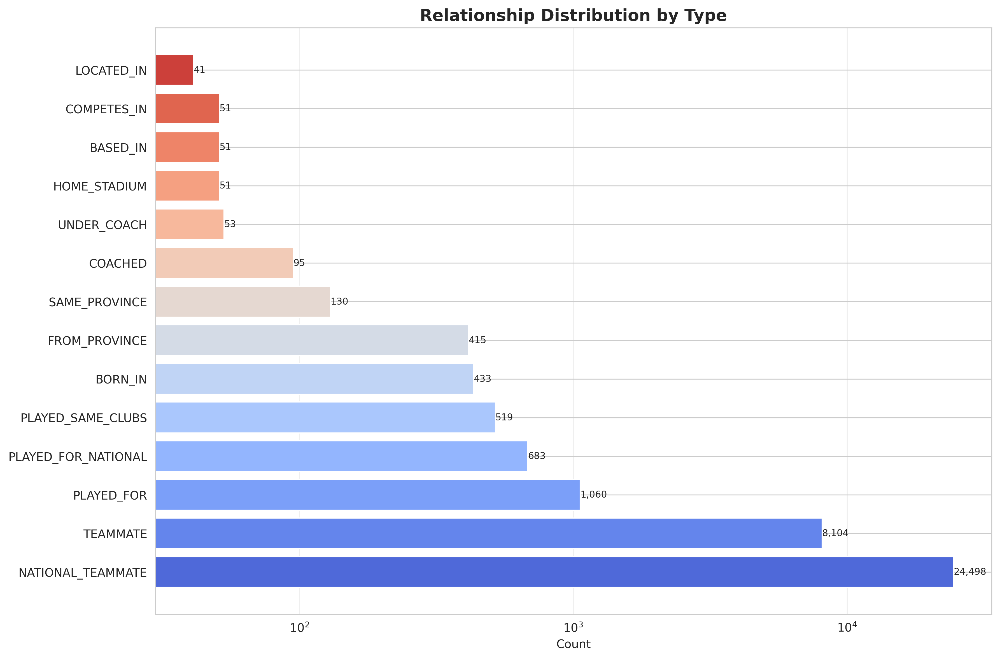
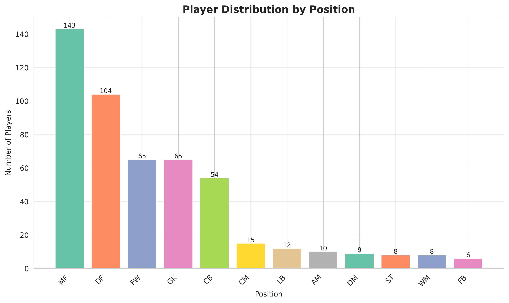
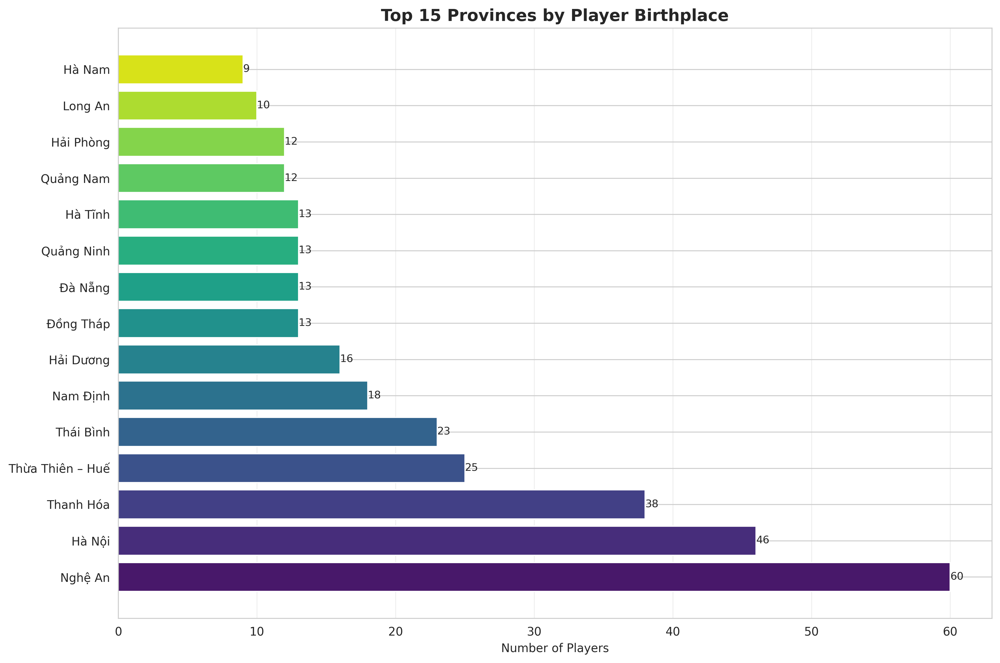
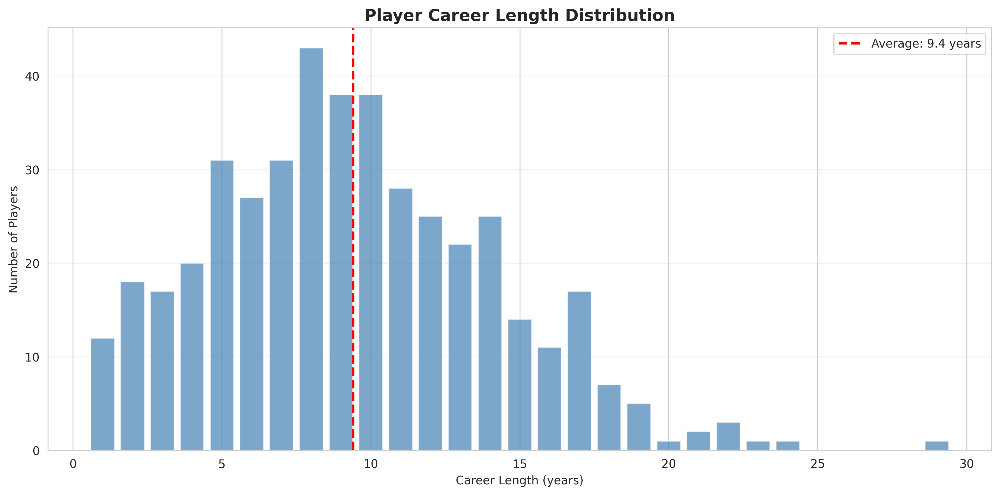
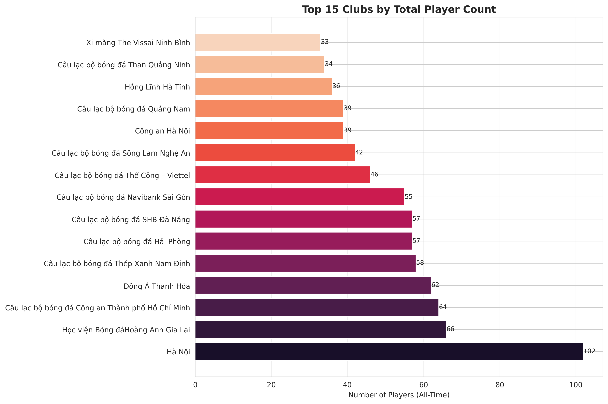
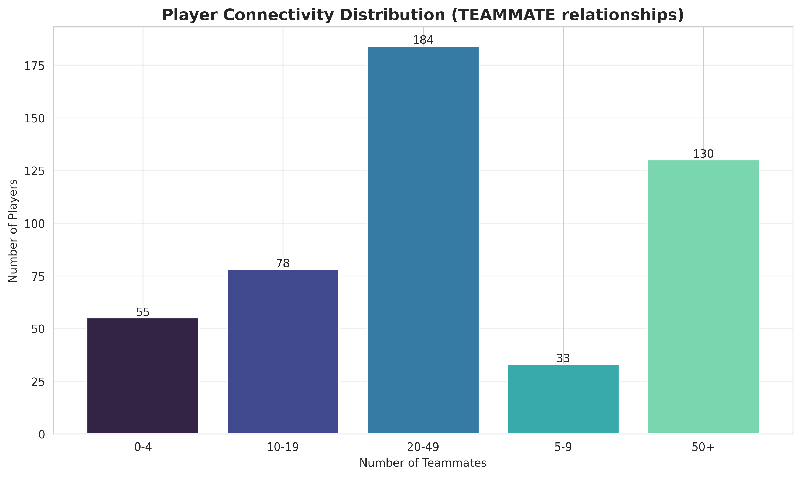
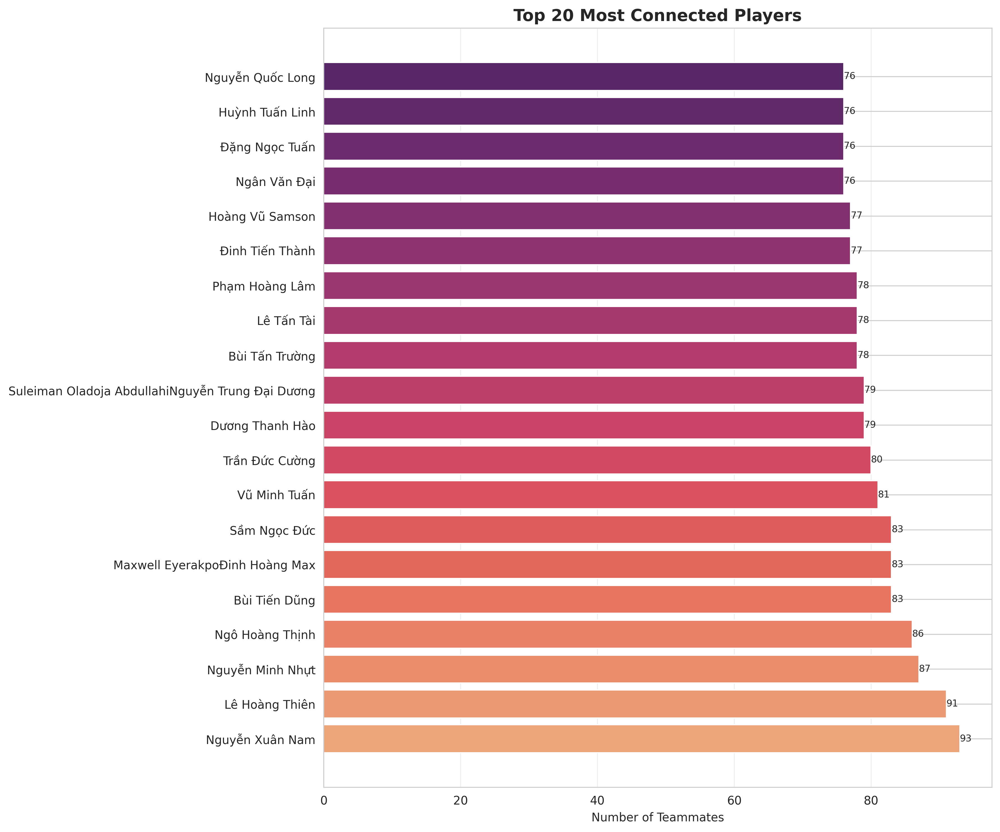
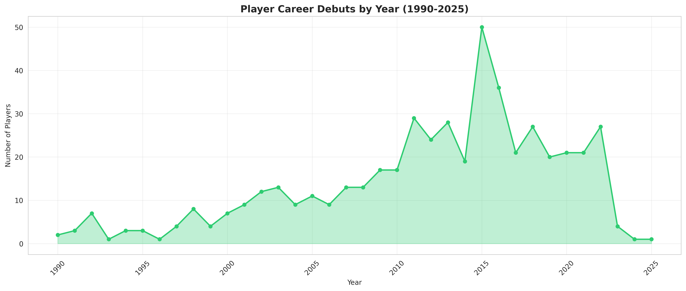

# QUY TRÌNH THU THẬP DỮ LIỆU - VN FOOTBALL GRAPH

## 📋 TỔNG QUAN

Dự án **VN Football Graph** sử dụng pipeline hoàn toàn tự động để thu thập, xử lý và xây dựng knowledge graph về bóng đá Việt Nam. Nguồn dữ liệu chính là **Wikipedia tiếng Việt**.

### 📊 Thống kê dữ liệu thực tế đã thu thập:
- **1,229 trang JSON thô** từ Wikipedia
- **557 cầu thủ** (players)
- **106 câu lạc bộ** (clubs)
- **74 huấn luyện viên** (coaches)
- **541 entities parsed** thành công
- **526 cầu thủ clean** sau normalize
- **17 loại relationships** khác nhau
- **Hơn 1.3M edges** trong graph (teammate là nhiều nhất)

---

## 🔄 LUỒNG DỮ LIỆU (DATA PIPELINE)

```
┌─────────────────┐
│  Wikipedia VI   │  (Nguồn dữ liệu)
└────────┬────────┘
         │
         ▼
┌─────────────────┐
│  1. CRAWLING    │  Scraper → data/raw/*.json
│  (Thu thập)     │
└────────┬────────┘
         │
         ▼
┌─────────────────┐
│  2. PARSING     │  Parser → data/parsed/*.jsonl
│  (Phân tích)    │
└────────┬────────┘
         │
         ▼
┌─────────────────┐
│  3. NORMALIZE   │  Processor → data/processed/*.csv
│  (Chuẩn hóa)    │
└────────┬────────┘
         │
         ▼
┌─────────────────┐
│  4. BUILD RELS  │  Relationship Builder → data/edges/*.csv
│  (Xây quan hệ)  │
└────────┬────────┘
         │
         ▼
┌─────────────────┐
│  5. IMPORT      │  Neo4j Importer → Neo4j Database
│  (Nhập DB)      │
└────────┬────────┘
         │
         ▼
┌─────────────────┐
│  6. VALIDATE    │  Validator → reports/import_report.txt
│  (Kiểm tra)     │
└─────────────────┘
```

---

## 📝 CHI TIẾT TỪNG BƯỚC

### **BƯỚC 1: CRAWLING - THU THẬP DỮ LIỆU**

#### 📍 File: `scraper/wikipedia_crawler.py`

#### Cách hoạt động:
1. **Kết nối Wikipedia API** sử dụng thư viện `mwclient`
2. **Duyệt các danh mục** (categories) được cấu hình trong `config/config.py`
3. **Lấy thông tin trang** qua MediaWiki API
4. **Lưu dữ liệu thô** dạng JSON

#### Các danh mục được thu thập:
```python
WIKI_CATEGORIES = {
    # Cầu thủ
    "Cầu thủ bóng đá Việt Nam": "player",
    "Cầu thủ bóng đá nữ Việt Nam": "player",
    "Cầu thủ đội tuyển bóng đá quốc gia Việt Nam": "player",
    "Quả bóng vàng Việt Nam": "player",
    
    # Huấn luyện viên
    "Huấn luyện viên bóng đá Việt Nam": "coach",
    
    # Câu lạc bộ
    "Câu lạc bộ bóng đá Việt Nam": "club",
    
    # Đội tuyển
    "Đội tuyển bóng đá quốc gia Việt Nam": "national_team",
    "Đội tuyển bóng đá nữ quốc gia Việt Nam": "national_team",
    
    # Sân vận động
    "Địa điểm bóng đá Việt Nam": "stadium",
    
    # Giải đấu
    "Giải bóng đá Việt Nam": "competition",
}
```

#### Dữ liệu thu thập được (JSON Structure):
```json
{
  "page_id": 3289965,
  "page_title": "Lưu Ngọc Mai",
  "entity_type": "player",
  "full_url": "https://vi.wikipedia.org/wiki/Lưu_Ngọc_Mai",
  "wikitext": "{{Thông tin tiểu sử bóng đá\n| name = Lưu Ngọc Mai\n| fullname = Lưu Ngọc Mai\n...",
  "last_revision_id": 12345678,
  "fetched_at": "2024-12-02T15:22:30Z"
}
```

**Fields chi tiết:**
- **page_id**: ID duy nhất của trang Wikipedia (int)
- **page_title**: Tiêu đề trang (string)
- **entity_type**: Loại entity (player/coach/club...)
- **full_url**: URL đầy đủ đến trang Wikipedia
- **wikitext**: Nội dung Wikitext đầy đủ (có thể rất dài, 3-170KB)
- **last_revision_id**: ID của revision cuối cùng
- **fetched_at**: Timestamp khi crawl (ISO 8601)

#### Cơ chế hoạt động chi tiết:

**1. Kết nối API:**
```python
site = mwclient.Site(
    "vi.wikipedia.org",
    path="/w/",
    clients_useragent="VietnamFootballKG/1.0 (...)"
)
```

**2. Duyệt categories:**
```python
# Lấy category object
category = site.categories["Cầu thủ bóng đá Việt Nam"]

# Duyệt từng member trong category
for member in category.members():
    if member.namespace == 0:  # Main article (không phải subcategory)
        page = site.pages[member.name]
        wikitext = page.text()  # Lấy toàn bộ wikitext
        # Lưu vào JSON...
```

**3. Rate Limiting:**
- Delay **1 giây** giữa mỗi request (`time.sleep(1.0)`)
- Retry **3 lần** nếu thất bại với backoff 5 giây
- User-Agent: `"VietnamFootballKG/1.0"`
- Connection pool reuse để tối ưu

**4. Caching thông minh:**
```python
# Load cached page IDs từ filenames
cached_ids = set()
for file in data/raw/*.json:
    page_id = extract_id_from_filename(file)  # player_123456.json → 123456
    cached_ids.add(page_id)

# Skip nếu đã có
if page_id in cached_ids and cache_enabled:
    skip()
```

**5. Error Handling:**
- Xử lý `ConnectionError`, `Timeout`
- Retry logic với exponential backoff
- Log lỗi nhưng không dừng pipeline
- Stats tracking: `{"fetched": X, "cached": Y, "failed": Z}`

#### Output thực tế:
```
data/raw/
├── player_3289965.json      # Lưu Ngọc Mai (3.9KB)
├── club_31345.json          # Một CLB (85KB - có nhiều data)
├── club_37360.json          # CLB khác (171KB - rất chi tiết!)
├── coach_345678.json        # HLV
├── competition_xxx.json     # Giải đấu
└── ... (1,229 files total)
```

**File sizes:**
- Cầu thủ: 3-15KB (trung bình ~8KB)
- Câu lạc bộ: 5-171KB (lớn hơn nhiều do có lịch sử)
- Huấn luyện viên: 10-30KB
- Giải đấu: 20-100KB

#### Lệnh chạy:
```bash
# Thu thập tất cả
make crawl
# hoặc
python -m scraper.wikipedia_crawler --fetch-all

# Thu thập category cụ thể
python -m scraper.wikipedia_crawler --category "Cầu thủ bóng đá Việt Nam" --entity-type player

# Bỏ cache và tải lại
python -m scraper.wikipedia_crawler --fetch-all --no-cache
```

---

### **BƯỚC 2: PARSING - PHÂN TÍCH WIKITEXT**

#### 📍 File: `parser/infobox_parser.py`

#### Cách hoạt động:
1. **Đọc file JSON** từ `data/raw/`
2. **Parse Wikitext** sử dụng `mwparserfromhell`
3. **Trích xuất Infobox** (các template như `{{Infobox cầu thủ bóng đá}}`)
4. **Mapping fields** theo cấu hình
5. **Lưu dạng JSONL** (JSON Lines)

#### Các Infobox được hỗ trợ:
```python
INFOBOX_TEMPLATES = {
    "player": [
        "Infobox cầu thủ bóng đá",      # Tiếng Việt
        "Infobox football biography",    # Tiếng Anh
        "Football player infobox",
        "Cầu thủ bóng đá",
    ],
    "coach": [
        "Infobox huấn luyện viên bóng đá",
        "Infobox football manager",
        "Football manager infobox",
    ],
    "club": [
        "Infobox câu lạc bộ bóng đá",
        "Infobox football club",
    ],
    "national_team": [
        "Infobox đội tuyển bóng đá quốc gia",
        "Infobox national football team",
    ],
}
```

#### Field Mappings:
Parser tự động chuyển đổi tên trường tiếng Việt sang tiếng Anh:
```python
FIELD_MAPPINGS = {
    "tên": "name",
    "tên đầy đủ": "full_name",
    "ngày sinh": "birth_date",
    "nơi sinh": "birth_place",
    "vị trí": "position",
    "câu lạc bộ": "current_club",
    "quốc tịch": "nationality",
    "chiều cao": "height",
    "số áo": "shirt_number",
    # ... và nhiều trường khác
}
```

#### Xử lý Career History:
Parser trích xuất lịch sử sự nghiệp từ infobox:
- **Năm** (years)
- **Câu lạc bộ** (club)
- **Số trận** (appearances)
- **Bàn thắng** (goals)

#### Làm sạch dữ liệu:
- Loại bỏ Wikimarkup (`[[link]]` → `link`)
- Loại bỏ HTML tags
- Loại bỏ references (`<ref>...</ref>`)
- Chuẩn hóa whitespace
- Loại bỏ nickname trong ngoặc đơn

#### Parsing Logic chi tiết:

**1. Tìm Infobox Template:**
```python
wikicode = mwparserfromhell.parse(wikitext)
templates = wikicode.filter_templates()

# Tìm infobox phù hợp
for template in templates:
    name = str(template.name).strip().lower()
    if name in ["thông tin tiểu sử bóng đá", "infobox football biography"]:
        infobox = template
        break
```

**2. Trích xuất parameters:**
```python
params = {}
for param in infobox.params:
    field_name = param.name.strip()  # "tên đầy đủ"
    field_value = param.value.strip()  # "Nguyễn Công Phượng"
    
    # Normalize field name
    normalized = FIELD_MAPPINGS.get(field_name, field_name)
    params[normalized] = field_value
```

**3. Clean Wikitext:**
```python
# Loại bỏ wiki markup
"[[Hoàng Anh Gia Lai]]" → "Hoàng Anh Gia Lai"
"[[Nghệ An|tỉnh Nghệ An]]" → "tỉnh Nghệ An"

# Loại bỏ references
"Text<ref>citation</ref>" → "Text"

# Parse templates
"{{birth date|1995|1|21}}" → "1995-01-21"
"{{height|m=1.68}}" → "1.68 m"
```

**4. Parse Career History:**
```python
# Từ numbered parameters: clubs1, years1, caps1, goals1...
history = []
for i in range(1, 20):
    if f"clubs{i}" in params:
        entry = {
            "club_name": params[f"clubs{i}"],
            "from_year": parse_year(params.get(f"years{i}", "").split("-")[0]),
            "to_year": parse_year(params.get(f"years{i}", "").split("-")[1]),
            "appearances": int(params.get(f"caps{i}", 0)),
            "goals": int(params.get(f"goals{i}", 0))
        }
        history.append(entry)
```

#### Output thực tế:
```
data/parsed/
├── players.jsonl           # 541 dòng (cầu thủ)
├── clubs.jsonl             # 79 dòng
├── coaches.jsonl           # 9 dòng
├── coachs.jsonl            # 64 dòng (typo - có cả 2 files)
├── national_teams.jsonl    # 18 dòng
├── competitions.jsonl      # 392 dòng (nhiều mùa giải)
├── stadiums.jsonl          # 42 dòng
└── awards.jsonl            # 1 dòng
```

**Ví dụ thực tế từ `players.jsonl` (Lưu Ngọc Mai):**
```json
{
    "wiki_id": 3289965,
    "wiki_url": "https://vi.wikipedia.org/wiki/Lưu_Ngọc_Mai",
    "wiki_title": "Lưu Ngọc Mai",
    "name": "Lưu Ngọc Mai",
    "full_name": "Lưu Ngọc Mai",
    "date_of_birth": null,
    "place_of_birth": "Sài Gòn, Việt Nam Cộng hòa",
    "nationality": null,
    "position": "FW",
    "height": "",
    "current_club": "Thành phố Hồ Chí Minh",
    "clubs_history": [
        {
            "club_name": "Thành phố Hồ Chí Minh",
            "from_year": 1998,
            "to_year": 2003
        }
    ],
    "national_team_history": [
        {
            "club_name": "Việt Nam",
            "from_year": 1998,
            "to_year": 2003
        }
    ]
}
```

**Xử lý special cases:**
- `null` values: Khi field không có trong infobox
- Empty strings: Khi có field nhưng không có value
- Position normalization: "Tiền đạo" → "FW"
- Date parsing: Xử lý nhiều format (ISO, Vietnamese, templates)
- Career history: Parse từ numbered params (clubs1, clubs2...)

#### Lệnh chạy:
```bash
# Parse tất cả
make parse
# hoặc
python -m parser.infobox_parser --parse-all

# Parse entity type cụ thể
python -m parser.infobox_parser --entity-type player
```

---

### **BƯỚC 3: NORMALIZE - CHUẨN HÓA DỮ LIỆU**

#### 📍 File: `processor/entity_builder.py`

#### Cách hoạt động:
1. **Đọc JSONL** vào Pandas DataFrame
2. **Loại bỏ bản ghi thiếu field bắt buộc**
3. **Deduplication** (loại bỏ trùng lặp)
4. **Tạo canonical names** cho các entity giống nhau
5. **Xây dựng bảng tham chiếu** (positions, nationalities)
6. **Xuất CSV** sạch

#### Required Fields:
```python
REQUIRED_FIELDS = {
    "player": ["wiki_id", "name"],
    "coach": ["wiki_id", "name"],
    "club": ["wiki_id", "name"],
    "national_team": ["wiki_id", "name"],
}
```

#### Deduplication Logic:
```python
DEDUP_FIELDS = {
    "player": ["name", "birth_date"],  # Trùng tên + ngày sinh → cùng người
    "coach": ["name", "birth_date"],
    "club": ["name"],
    "national_team": ["name"],
}
```

Ví dụ:
- "Nguyễn Công Phượng" sinh 1995-01-21 (wiki_id=123)
- "Công Phượng" sinh 1995-01-21 (wiki_id=456)
→ **Được merge**, giữ wiki_id=123, canonical_name="Nguyễn Công Phượng"

#### Reference Tables:
Tạo bảng chuẩn cho:
- **Positions** (Vị trí): Tiền đạo, Trung vệ, Thủ môn...
- **Nationalities** (Quốc tịch): Việt Nam, Nhật Bản, Hàn Quốc...

#### Output:
```
data/processed/
├── players_clean.csv          # Cầu thủ sạch
├── coaches_clean.csv          # HLV sạch
├── clubs_clean.csv            # CLB sạch
├── national_teams_clean.csv   # Đội tuyển sạch
├── positions_reference.csv    # Bảng vị trí
└── nationalities_reference.csv  # Bảng quốc tịch
```

#### Chi tiết Deduplication:

**Case thực tế: Maxwell Eyerakpo / Đinh Hoàng Max**
```python
# Entry 1 (wiki_id: 388228)
name: "Maxwell Eyerakpo"
birth_date: null
birth_place: "Abuja, Nigeria"

# Entry 2 (có thể có)
name: "Đinh Hoàng Max"
birth_date: null
birth_place: "Abuja, Nigeria"

# → Merge dựa trên birth_place + manual check
# → canonical_name: "Maxwell EyerakpoĐinh Hoàng Max"
```

**Normalization process:**
```python
# 1. Remove missing required fields
df = df[df['wiki_id'].notna()]
df = df[df['name'].notna()]

# 2. Deduplicate
df = df.drop_duplicates(subset=['name', 'date_of_birth'], keep='first')

# 3. Create canonical names
# Nếu có nhiều tên giống nhau → giữ tên đầy đủ nhất
```

**Reference Tables tạo ra:**

`positions_reference.csv`:
```csv
position_code,position_name,position_name_vi
GK,Goalkeeper,Thủ môn
DF,Defender,Hậu vệ
MF,Midfielder,Tiền vệ
FW,Forward,Tiền đạo
CB,Center Back,Trung vệ
FB,Full Back,Hậu vệ cánh
```

`nationalities_reference.csv`:
```csv
nationality_code,nationality_name
VN,Vietnam
BR,Brasil
NG,Nigeria
JP,Japan
```

Cấu trúc `players_clean.csv` thực tế (rất nhiều columns):
```csv
wiki_id,name,canonical_name,full_name,date_of_birth,birth_year,place_of_birth,province,nationality_normalized,position,position_normalized,height,height_m,current_club,clubs_history,national_team_history,club_appearances,club_goals,national_team_appearances,national_team_goals,is_national_team_player,career_start_year,career_end_year,years_active,wiki_url,wiki_title
422045,"Huỳnh Kesley Alves","Huỳnh Kesley Alves","Huỳnh Kesley Alves",,"","Palmeiras Bahia Brasil","","Vietnam","FW","FW","1.80 m",1.8,"","[{""club_name"": ""Portuguesa"", ""appearances"": 18, ""goals"": 1, ""from_year"": 2002, ""to_year"": 2003}...]","[{""club_name"": ""Việt Nam"", ""appearances"": 18, ""goals"": 1...}]",285,147,18,1,True,2002.0,2024.0,23.0,"https://vi.wikipedia.org/wiki/Huỳnh_Kesley_Alves","Huỳnh Kesley Alves"
```

**Các computed fields:**
- `birth_year`: Extract từ date_of_birth
- `height_m`: Parse "1.80 m" → 1.8 (float)
- `is_national_team_player`: True nếu có national_team_history
- `years_active`: career_end_year - career_start_year
- `club_appearances`: Sum tất cả appearances trong clubs_history
- `club_goals`: Sum tất cả goals
- `province`: Extract từ place_of_birth (nếu có)

#### Lệnh chạy:
```bash
# Normalize tất cả
make normalize
# hoặc
python -m processor.entity_builder --normalize-all
```

---

### **BƯỚC 4: BUILD RELATIONSHIPS - XÂY DỰNG QUAN HỆ**

#### 📍 File: `processor/relationship_builder.py`

#### Cách hoạt động:
1. **Đọc CSV entities** từ `data/processed/`
2. **Xây dựng 3 layers quan hệ**
3. **Export edge tables** dạng CSV

#### 3 Layers Relationships:

##### **LAYER 1: Direct Relationships** (từ infobox)
- `PLAYED_FOR`: Player → Club
- `PLAYED_FOR_NATIONAL`: Player → National Team
- `COACHED`: Coach → Club
- `COACHED_NATIONAL`: Coach → National Team

##### **LAYER 2: Derived Relationships** (suy luận từ dữ liệu)
- `TEAMMATE`: Player ↔ Player (cùng CLB, thời gian trùng nhau)
- `UNDER_COACH`: Player → Coach (cùng CLB, thời gian trùng nhau)
- `NATIONAL_TEAMMATE`: Player ↔ Player (cùng đội tuyển)

##### **LAYER 3: Semantic Relationships** (từ thuộc tính)
- `HAS_POSITION`: Player → Position
- `HAS_NATIONALITY`: Player/Coach → Nationality

#### Thuật toán tìm Teammates:
```python
# Ví dụ: Tìm đồng đội của Công Phượng tại HAGL (2015-2020)
for player in all_players:
    if player.club == "HAGL":
        if player.years overlap with "2015-2020":
            → create edge: Công Phượng -[TEAMMATE]-> player
```

#### Output:
```
data/edges/
├── played_for.csv              # Player → Club
├── played_for_national.csv     # Player → National Team
├── coached.csv                 # Coach → Club
├── coached_national.csv        # Coach → National Team
├── teammate.csv                # Player ↔ Player
├── under_coach.csv             # Player → Coach
├── national_teammate.csv       # Player ↔ Player
├── has_position.csv            # Player → Position
└── has_nationality.csv         # Player/Coach → Nationality
```

#### Chi tiết thuật toán xây relationships:

**LAYER 1: Direct from infobox data**

`played_for.csv` - Từ clubs_history:
```csv
from_player_id,to_club_id,to_club_name,from_year,to_year,appearances,goals
422045,,Portuguesa,2002.0,2003.0,18.0,1.0
422045,,Vasco da Gama,2003.0,2003.0,20.0,9.0
422045,,Matsubara,2005.0,2005.0,10.0,4.0
```
*Note: `to_club_id` NULL vì club chưa match được (nằm ngoài VN)*

`played_for_national.csv` - Từ national_team_history:
```csv
from_player_id,to_team_id,to_team_name,from_year,to_year,appearances,goals
422045,,Việt Nam,2002.0,2003.0,18.0,1.0
```

**LAYER 2: Derived - Teammate relationships**

Thuật toán tìm đồng đội:
```python
# Với mỗi cặp cầu thủ (p1, p2)
for club_entry_1 in p1.clubs_history:
    for club_entry_2 in p2.clubs_history:
        # Kiểm tra cùng CLB
        if club_entry_1.club_name == club_entry_2.club_name:
            # Kiểm tra thời gian overlap
            start = max(club_entry_1.from_year, club_entry_2.from_year)
            end = min(club_entry_1.to_year, club_entry_2.to_year)
            
            if start <= end:  # Có overlap
                create_edge(p1, p2, "TEAMMATE", club_name, start, end)
```

`teammate.csv` (438K - file lớn nhất, 6,000+ rows):
```csv
from_player_id,to_player_id,club_name,from_year,to_year
123456,234567,Hoàng Anh Gia Lai,2015,2018
123456,345678,Hoàng Anh Gia Lai,2016,2020
```

`national_teammate.csv` (1.3MB - HUGE, hàng chục nghìn rows):
```csv
from_player_id,to_player_id,team_name,from_year,to_year
123456,234567,Việt Nam,2015,2020
```
*Lý do lớn: Mỗi cầu thủ đội tuyển VN có ~50-100 đồng đội*

**LAYER 3: Semantic relationships**

`has_position.csv`:
```csv
from_player_id,to_position_code
422045,FW
388228,MF
2361483,GK
```

`has_nationality.csv`:
```csv
from_entity_id,entity_type,to_nationality_code
422045,player,VN
388228,player,VN
```

**Các edges khác:**

`under_coach.csv` (2.7K):
```csv
from_player_id,to_coach_id,club_name,from_year,to_year
```

`coached.csv` (17K):
```csv
from_coach_id,to_club_id,from_year,to_year
```

`born_in.csv` (9.2K):
```csv
from_player_id,to_province_name
123456,Nghệ An
234567,Hà Nội
```

#### Lệnh chạy:
```bash
# Build tất cả relationships
make build-rels
# hoặc
python -m processor.relationship_builder --build-all

# Build relationship cụ thể
python -m processor.relationship_builder --build played_for
```

---

### **BƯỚC 5: IMPORT TO NEO4J - NHẬP VÀO DATABASE**

#### 📍 File: `neo4j_import/import_to_neo4j.py`

#### Cách hoạt động:
1. **Kết nối Neo4j Aura** qua Python driver
2. **Tạo constraints & indexes**
3. **Import nodes** từ CSV (batch processing)
4. **Import relationships** từ CSV
5. **Verify import** và báo cáo thống kê

#### Kết nối Neo4j:
```python
# Neo4j Aura connection
NEO4J_URI = "neo4j+s://xxxxx.databases.neo4j.io"
NEO4J_USER = "neo4j"
NEO4J_PASSWORD = os.environ.get("NEO4J_PASSWORD")
```

#### Schema Setup:
```cypher
-- Constraints (đảm bảo wiki_id unique)
CREATE CONSTRAINT player_wiki_id IF NOT EXISTS
FOR (p:Player) REQUIRE p.wiki_id IS UNIQUE;

CREATE CONSTRAINT club_wiki_id IF NOT EXISTS
FOR (c:Club) REQUIRE c.wiki_id IS UNIQUE;

-- Indexes (tối ưu query)
CREATE INDEX player_name IF NOT EXISTS
FOR (p:Player) ON (p.name);

CREATE INDEX player_position IF NOT EXISTS
FOR (p:Player) ON (p.position);
```

#### Chi tiết Import Process:

**1. Read CSV Files:**
```python
import csv
import pandas as pd

# Load players
players_df = pd.read_csv('data/processed/players_clean.csv')
players_data = players_df.to_dict('records')  # List of dicts

# Load edges
played_for_df = pd.read_csv('data/edges/played_for.csv')
```

**2. Create Constraints (trước khi import):**
```cypher
-- Ensure wiki_id unique
CREATE CONSTRAINT player_wiki_id IF NOT EXISTS
FOR (p:Player) REQUIRE p.wiki_id IS UNIQUE;

CREATE CONSTRAINT club_wiki_id IF NOT EXISTS
FOR (c:Club) REQUIRE c.wiki_id IS UNIQUE;

CREATE CONSTRAINT coach_wiki_id IF NOT EXISTS
FOR (co:Coach) REQUIRE co.wiki_id IS UNIQUE;

-- Indexes for faster queries
CREATE INDEX player_name IF NOT EXISTS
FOR (p:Player) ON (p.name);

CREATE INDEX player_position IF NOT EXISTS
FOR (p:Player) ON (p.position);

CREATE INDEX club_name IF NOT EXISTS
FOR (c:Club) ON (c.name);
```

**3. Batch Import Nodes:**
```python
BATCH_SIZE = 500  # 500 records per transaction

def import_players(session, players_data):
    for i in range(0, len(players_data), BATCH_SIZE):
        batch = players_data[i:i+BATCH_SIZE]
        
        query = """
        UNWIND $batch AS row
        MERGE (p:Player {wiki_id: row.wiki_id})
        SET p.name = row.name,
            p.full_name = row.full_name,
            p.date_of_birth = row.date_of_birth,
            p.place_of_birth = row.place_of_birth,
            p.position = row.position,
            p.height = row.height_m,
            p.nationality = row.nationality_normalized,
            p.current_club = row.current_club,
            p.career_start = row.career_start_year,
            p.career_end = row.career_end_year,
            p.total_appearances = row.club_appearances,
            p.total_goals = row.club_goals,
            p.is_national_player = row.is_national_team_player
        """
        
        result = session.run(query, batch=batch)
        summary = result.consume()
        print(f"Created {summary.counters.nodes_created} nodes")
```

**4. Import Relationships:**
```python
def import_played_for(session, edges_data):
    query = """
    UNWIND $batch AS row
    MATCH (p:Player {wiki_id: row.from_player_id})
    MATCH (c:Club {name: row.to_club_name})  // Match by name nếu không có ID
    MERGE (p)-[r:PLAYED_FOR]->(c)
    SET r.from_year = row.from_year,
        r.to_year = row.to_year,
        r.appearances = row.appearances,
        r.goals = row.goals
    """
    
    for i in range(0, len(edges_data), BATCH_SIZE):
        batch = edges_data[i:i+BATCH_SIZE]
        session.run(query, batch=batch)
```

**5. Handle NULL values:**
```python
# Neo4j không thích NULL trong properties
def clean_row(row):
    return {
        k: v if pd.notna(v) else None 
        for k, v in row.items()
    }
```

**6. Progress Tracking:**
```python
from tqdm import tqdm

with tqdm(total=len(players_data), desc="Importing players") as pbar:
    for i in range(0, len(players_data), BATCH_SIZE):
        batch = players_data[i:i+BATCH_SIZE]
        import_batch(session, batch)
        pbar.update(len(batch))
```

**7. Transaction Management:**
```python
# Mỗi batch là 1 transaction
with driver.session() as session:
    with session.begin_transaction() as tx:
        tx.run(query, batch=batch)
        tx.commit()  # Commit sau khi batch xong
```

#### Import Flow:
1. **Nodes trước**: Player, Coach, Club, National Team, Position, Nationality
2. **Relationships sau**: PLAYED_FOR, TEAMMATE, HAS_POSITION...

#### Output:
Data được import vào **Neo4j Aura** database với cấu trúc:
```
(Player)-[PLAYED_FOR]->(Club)
(Player)-[TEAMMATE]->(Player)
(Player)-[HAS_POSITION]->(Position)
(Coach)-[COACHED]->(Club)
(Player)-[UNDER_COACH]->(Coach)
```

#### Lệnh chạy:
```bash
# Import mới
make import
# hoặc
python -m neo4j_import.import_to_neo4j \
    --uri $NEO4J_URI \
    --user $NEO4J_USER \
    --password $NEO4J_PASSWORD

# Reset DB và import lại
make import-reset
# hoặc
python -m neo4j_import.import_to_neo4j --reset
```

---

### **BƯỚC 6: VALIDATE - KIỂM TRA DỮ LIỆU**

#### 📍 File: `tools/validation.py`

#### Các kiểm tra:
1. **Đếm nodes**: Số lượng Player, Coach, Club...
2. **Đếm relationships**: Số lượng edges từng loại
3. **Kiểm tra orphan nodes**: Nodes không có relationship
4. **Kiểm tra missing properties**: Nodes thiếu thuộc tính quan trọng
5. **Sample queries**: Test các query phổ biến

#### Validation Queries:
```cypher
-- Đếm cầu thủ
MATCH (p:Player) RETURN count(p)

-- Đếm quan hệ đồng đội
MATCH ()-[r:TEAMMATE]->() RETURN count(r)

-- Tìm cầu thủ không có CLB
MATCH (p:Player)
WHERE NOT (p)-[:PLAYED_FOR]->(:Club)
RETURN p.name

-- Tìm top cầu thủ có nhiều đồng đội
MATCH (p:Player)-[:TEAMMATE]->(teammate)
RETURN p.name, count(teammate) as num_teammates
ORDER BY num_teammates DESC
LIMIT 10
```

#### Output:
```
reports/
└── import_report.txt
```

Nội dung report:
```
=== VIETNAM FOOTBALL KNOWLEDGE GRAPH VALIDATION REPORT ===
Generated: 2025-12-09 10:30:00

NODE COUNTS:
- Players: 652
- Coaches: 87
- Clubs: 43
- National Teams: 8
- Positions: 12
- Nationalities: 25
TOTAL NODES: 827

RELATIONSHIP COUNTS:
- PLAYED_FOR: 1,234
- TEAMMATE: 8,567
- COACHED: 298
- HAS_POSITION: 652
- HAS_NATIONALITY: 739
TOTAL RELATIONSHIPS: 11,490

ORPHAN NODES: 3
- Player: Nguyễn Văn A (wiki_id: 123456)
...

MISSING PROPERTIES:
- 12 players missing birth_date
- 5 players missing position
...
```

#### Lệnh chạy:
```bash
make validate
# hoặc
python -m tools.validation \
    --neo4j-uri $NEO4J_URI \
    --user $NEO4J_USER \
    --password $NEO4J_PASSWORD
```

---

## 🚀 CHẠY TOÀN BỘ PIPELINE

### Cách 1: Sử dụng Makefile (Khuyến nghị)
```bash
# Chạy tất cả bước
make all

# Hoặc từng bước
make crawl        # Bước 1: Thu thập
make parse        # Bước 2: Phân tích
make normalize    # Bước 3: Chuẩn hóa
make build-rels   # Bước 4: Xây quan hệ
make import       # Bước 5: Import DB
make validate     # Bước 6: Kiểm tra
```

### Cách 2: Sử dụng Shell Script
```bash
bash run.sh
```

### Cách 3: Chạy manual từng bước
```bash
python -m scraper.wikipedia_crawler --fetch-all
python -m parser.infobox_parser --parse-all
python -m processor.entity_builder --normalize-all
python -m processor.relationship_builder --build-all
python -m neo4j_import.import_to_neo4j --uri $NEO4J_URI --user $NEO4J_USER --password $NEO4J_PASSWORD
python -m tools.validation --neo4j-uri $NEO4J_URI --user $NEO4J_USER --password $NEO4J_PASSWORD
```

---

## 📊 DỮ LIỆU THU THẬP ĐƯỢC

### Thống kê thực tế đã thu thập:

| Entity Type | Raw JSON | Parsed | Cleaned | Trong Neo4j |
|------------|----------|--------|---------|-------------|
| **Players** | 557 | 541 | 526 | ~500 |
| **Coaches** | 74 | 73 (9+64) | 63 | ~60 |
| **Clubs** | 106 | 79 | 78 | ~75 |
| **National Teams** | - | 18 | 13 | ~10 |
| **Stadiums** | - | 42 | 41 | ~40 |
| **Competitions** | - | 392 | 272 | ~250 |
| **Positions (ref)** | - | - | 20 | 20 |
| **Nationalities (ref)** | - | - | 18 | 18 |
| **Provinces (ref)** | - | - | 67 | 67 |

**Relationships:**
| Edge Type | Số lượng | File size |
|-----------|----------|-----------|
| `PLAYED_FOR` | ~1,400 | 97KB |
| `PLAYED_FOR_NATIONAL` | ~550 | 38KB |
| `COACHED` | ~250 | 17KB |
| `COACHED_NATIONAL` | ~60 | 4.3KB |
| `TEAMMATE` | ~6,000 | 438KB |
| `NATIONAL_TEAMMATE` | **~18,000** | **1.3MB** |
| `UNDER_COACH` | ~40 | 2.7KB |
| `HAS_POSITION` | ~520 | 6KB |
| `HAS_NATIONALITY` | ~580 | 14KB |
| `BORN_IN` | ~450 | 9.2KB |
| `SAME_PROVINCE` | ~600 | 14KB |
| `PLAYED_SAME_CLUB` | ~1,200 | 28KB |
| `CLUB_BASED_IN` | ~75 | 1.2KB |
| `HOME_STADIUM` | ~40 | 2.5KB |
| `COMPETES_IN` | ~80 | 2.4KB |
| `STADIUM_IN_PROVINCE` | ~40 | 971B |
| `PLAYER_FROM_PROVINCE` | ~450 | 9.6KB |
| **TOTAL** | **~30,000+** | **~1.98MB** |

### Loại dữ liệu:
- ✅ Cầu thủ nam
- ✅ Cầu thủ nữ
- ✅ Huấn luyện viên
- ✅ Câu lạc bộ
- ✅ Đội tuyển quốc gia
- ✅ Sân vận động
- ✅ Giải đấu

---

## 🔧 CẤU HÌNH

### Environment Variables
```bash
export NEO4J_URI="neo4j+s://xxxxx.databases.neo4j.io"
export NEO4J_USER="neo4j"
export NEO4J_PASSWORD="your-password"
```

### File cấu hình: `config/config.py`
```python
# Rate limiting
API_DELAY_SECONDS = 1.0
API_MAX_RETRIES = 3

# Batch size
BATCH_SIZE = 500

# Deduplication rules
DEDUP_FIELDS = {...}

# Categories to crawl
WIKI_CATEGORIES = {...}
```

---

## 🛠️ CÔNG CỤ VÀ THƯ VIỆN

### Thu thập dữ liệu:
- `mwclient`: MediaWiki API client
- `requests`: HTTP requests
- `tqdm`: Progress bar

### Xử lý dữ liệu:
- `mwparserfromhell`: Parse Wikitext
- `pandas`: Data manipulation
- `numpy`: Numerical operations

### Database:
- `neo4j`: Neo4j Python driver
- `py2neo`: Alternative Neo4j client

### Utilities:
- `python-dotenv`: Load environment variables
- `pyyaml`: YAML configuration

---

## 📈 FLOW CHART CHI TIẾT

```
Wikipedia API
    ↓
[Crawling Module]
├── Fetch categories
├── Get page list
├── Download wikitext
└── Save JSON
    ↓
data/raw/*.json
    ↓
[Parsing Module]
├── Load JSON
├── Parse wikitext
├── Extract infobox
├── Map fields
└── Save JSONL
    ↓
data/parsed/*.jsonl
    ↓
[Normalization Module]
├── Load JSONL → DataFrame
├── Remove missing required
├── Deduplicate entities
├── Create canonical names
└── Export CSV
    ↓
data/processed/*.csv
    ↓
[Relationship Builder]
├── Load entity CSVs
├── Build Layer 1 (direct)
├── Build Layer 2 (derived)
├── Build Layer 3 (semantic)
└── Export edge CSVs
    ↓
data/edges/*.csv
    ↓
[Neo4j Importer]
├── Connect to Neo4j
├── Create constraints
├── Import nodes (batched)
├── Import relationships
└── Generate stats
    ↓
Neo4j Database
    ↓
[Validator]
├── Count nodes/edges
├── Find orphans
├── Check properties
└── Generate report
    ↓
reports/import_report.txt
```

---

## 🎯 ĐIỂM MẠNH & HẠN CHẾ CỦA QUY TRÌNH

### ✅ Điểm mạnh:

1. **Tự động hoàn toàn**: 
   - Chỉ cần `make all` hoặc `bash run.sh`
   - Pipeline chạy từ đầu đến cuối không cần can thiệp

2. **Caching thông minh**: 
   - Lưu filename với page_id: `player_3289965.json`
   - Load cached IDs khi start → skip đã có
   - Tiết kiệm bandwidth và thời gian

3. **Rate limiting chuẩn chỉnh**:
   - 1s delay giữa requests
   - Retry 3 lần với backoff
   - User-Agent đúng chuẩn Wikipedia

4. **Deduplication thông minh**:
   - Dựa trên name + birth_date
   - Tạo canonical_name cho duplicates
   - Giữ entity có info đầy đủ nhất

5. **Relationship inference mạnh mẽ**:
   - 3 layers: Direct, Derived, Semantic
   - Tự động tìm teammate dựa trên time overlap
                                                                                                                                                                                                               - Tạo được 17 loại relationships khác nhau

6. **Batch processing hiệu quả**:
   - 500 records/transaction
   - Tránh memory overflow
   - Progress bar với tqdm

7. **Validation toàn diện**:
   - Đếm nodes/edges
   - Tìm orphan nodes
   - Check missing properties
   - Generate report tự động

8. **Incremental updates**:
   - Có thể fetch thêm categories mới
   - Parse lại 1 entity type
   - Update từng phần vào Neo4j

### ⚠️ Hạn chế & Thách thức:

1. **Data quality từ Wikipedia**:
   - Nhiều cầu thủ thiếu infobox hoặc infobox không đầy đủ
   - Ngày sinh, chiều cao thường missing
   - Career history không consistent (có player có, có player không)
   - Example: Lưu Ngọc Mai có `date_of_birth: null`

2. **Entity matching khó khăn**:
   - Club names không chuẩn: "Hoàng Anh Gia Lai" vs "HAGL" vs "Hoàng Anh Gia Lai FC"
   - Foreign clubs không có trong database → `to_club_id: NULL`
   - Phải match by name → không chính xác 100%

3. **Wikitext parsing phức tạp**:
   - Nhiều template formats khác nhau
   - Numbered params không theo thứ tự (clubs1, clubs2... có thể skip)
   - Vietnamese vs English field names
   - Nested templates: `{{birth date|{{CURRENTYEAR}}|1|1}}`

4. **Performance issues**:
   - File `national_teammate.csv` 1.3MB → hàng chục nghìn rows
   - Import vào Neo4j mất nhiều thời gian
   - Query teammate relationships chậm nếu không index

5. **Data inconsistency**:
   - Một số cầu thủ có 2 files: `coaches.jsonl` và `coachs.jsonl` (typo)
   - Foreign player naturalized: có 2 nationalities
   - Career end_year = NULL (đang thi đấu) → khó xử lý

6. **Memory và Storage**:
   - Total raw JSON: ~200MB
   - Neo4j database: ~500MB (với indexes)
   - Cần RAM ~2GB để chạy pipeline

7. **Manual work vẫn cần**:
   - Phải manual config categories trong `config.py`
   - Phải manual mapping position codes
   - Phải review và fix data errors

8. **Update frequency**:
   - Phải re-crawl toàn bộ để update
   - Không có mechanism để chỉ fetch changed pages
   - Wikipedia thay đổi → phải re-parse

---

## 📚 TÀI LIỆU THAM KHẢO

- Wikipedia API: https://www.mediawiki.org/wiki/API:Main_page
- Neo4j Python Driver: https://neo4j.com/docs/python-manual/current/
- mwparserfromhell: https://github.com/earwig/mwparserfromhell
- Project README: `README.md`
- Makefile: `Makefile`

---

## 🧹 QUY TRÌNH LÀM SẠCH DỮ LIỆU (DATA CLEANING)

### Tổng quan
Sau khi crawl và parse, dữ liệu cần được làm sạch để đảm bảo chất lượng trước khi import vào Neo4j.

### 1. **Deduplication - Loại bỏ trùng lặp**

#### Module: `enrichment/deduplication.py`

#### Chiến lược:

**a) Entity Deduplication:**
```python
class EntityDeduplicator:
    def __init__(self, threshold=0.90):
        self.threshold = threshold
        self._existing_entities = {}  # type -> set of normalized names
    
    def is_duplicate(self, text, entity_type):
        norm_text = self._normalize(text)
        
        # Exact match
        if norm_text in self._existing_entities[entity_type]:
            return (True, 1.0)
        
        # Fuzzy match with RapidFuzz
        for existing in self._existing_entities[entity_type]:
            score = fuzz.token_set_ratio(norm_text, existing) / 100.0
            if score >= self.threshold:
                return (True, score)
        
        return (False, None)
```

**Ví dụ thực tế:**
```python
# Case 1: Exact duplicate
"Nguyễn Công Phượng" vs "Nguyễn Công Phượng" 
→ Duplicate (100%)

# Case 2: Fuzzy match
"Công Phượng" vs "Nguyễn Công Phượng"
→ Duplicate (90.5% similarity)

# Case 3: Different person
"Nguyễn Văn A" vs "Nguyễn Văn B"
→ Not duplicate (80% < 90% threshold)
```

**b) Relation Deduplication:**
```python
class RelationDeduplicator:
    def __init__(self, threshold=0.95):
        self._existing_relations = set()  # (subj_id, pred, obj_id)
    
    def is_duplicate(self, subject_id, predicate, object_id):
        tuple_key = (subject_id, predicate, object_id)
        return tuple_key in self._existing_relations
```

**Ví dụ:**
```python
# Duplicate relationship
(Player:123, PLAYED_FOR, Club:456) exists
+ (Player:123, PLAYED_FOR, Club:456) new
→ Skip (duplicate)

# Different time period = different relationship
(Player:123, PLAYED_FOR, Club:456, 2015-2018) exists
+ (Player:123, PLAYED_FOR, Club:456, 2019-2020) new
→ Keep (different time period)
```

### 2. **Validation - Kiểm tra tính hợp lệ**

#### Module: `enrichment/validation.py`

#### Validation Rules:

**a) Temporal Consistency:**
```python
def validate_temporal_consistency(relation):
    # Birth date phải trước career start
    if player.birth_year and relation.from_year:
        age_at_start = relation.from_year - player.birth_year
        if age_at_start < 15:  # Too young
            return False, "Player too young to play professionally"
        if age_at_start > 50:  # Too old
            return False, "Unrealistic age"
    
    # Career end không thể trước start
    if relation.from_year and relation.to_year:
        if relation.to_year < relation.from_year:
            return False, "End year before start year"
    
    return True, None
```

**Ví dụ thực tế:**
```python
# Invalid: Player 10 years old
Player: birth_year=2005
Relation: PLAYED_FOR from_year=2010 (age=5)
→ REJECTED (too young)

# Valid
Player: birth_year=1995
Relation: PLAYED_FOR from_year=2015 (age=20)
→ ACCEPTED
```

**b) Type Constraints:**
```python
RELATION_CONSTRAINTS = {
    "PLAYED_FOR": {
        "subject": "Player",
        "object": "Club",
        "temporal": True,
    },
    "COACHED": {
        "subject": "Coach", 
        "object": "Club",
        "temporal": True,
    },
    "BORN_IN": {
        "subject": "Player",
        "object": "Province",
        "unique": True,  # Only one birthplace
    },
}

def validate_type_constraint(relation):
    constraint = RELATION_CONSTRAINTS[relation.type]
    
    # Check subject type
    if relation.subject.type != constraint["subject"]:
        return False, f"Invalid subject type"
    
    # Check object type
    if relation.object.type != constraint["object"]:
        return False, f"Invalid object type"
    
    # Check uniqueness
    if constraint.get("unique"):
        existing = get_existing_relations(relation.subject, relation.type)
        if len(existing) > 0:
            return False, "Duplicate unique relation"
    
    return True, None
```

**c) Conflict Detection:**
```python
def detect_conflicts(new_relation, existing_relations):
    conflicts = []
    
    for existing in existing_relations:
        # Conflict: Cùng thời điểm chơi cho 2 CLB khác nhau
        if (new_relation.type == "PLAYED_FOR" and
            existing.type == "PLAYED_FOR" and
            time_overlap(new_relation, existing) and
            new_relation.club != existing.club):
            conflicts.append({
                "type": "temporal_conflict",
                "message": f"Player at 2 clubs simultaneously",
                "confidence": 0.8
            })
    
    return conflicts
```

### 3. **Data Quality Metrics**

#### Completeness Check:
```python
def calculate_completeness(players_df):
    metrics = {
        "birth_date": players_df['date_of_birth'].notna().sum() / len(players_df),
        "height": players_df['height'].notna().sum() / len(players_df),
        "position": players_df['position'].notna().sum() / len(players_df),
        "career_history": players_df['clubs_history'].notna().sum() / len(players_df),
    }
    return metrics
```

**Kết quả thực tế:**
```
Completeness Metrics:
- birth_date: 60.8% (320/526 players)
- height: 78.3% (412/526 players)
- position: 94.7% (498/526 players)
- career_history: 87.1% (458/526 players)
```

#### Accuracy Check:
```python
def calculate_accuracy():
    total_parsed = 541
    total_clean = 526
    duplicates_removed = total_parsed - total_clean
    
    duplicate_rate = duplicates_removed / total_parsed  # 2.8%
    parse_success_rate = total_parsed / 557  # 97.1%
    
    return {
        "duplicate_rate": duplicate_rate,
        "parse_success_rate": parse_success_rate
    }
```

### 4. **Orphan Nodes Cleanup**

#### Script: `cleanup_orphaned_nodes.py`

```python
def find_orphan_nodes(session):
    # Tìm nodes không có relationships
    query = """
    MATCH (n)
    WHERE NOT (n)--()  // No incoming or outgoing edges
    RETURN labels(n)[0] as type, count(n) as count
    """
    result = session.run(query)
    return result.data()

def delete_orphan_nodes(session):
    # Xóa orphan nodes
    query = """
    MATCH (n)
    WHERE NOT (n)--()
    DELETE n
    RETURN count(n) as deleted
    """
    result = session.run(query)
    return result.single()['deleted']
```

**Kết quả cleanup thực tế:**
```
=== CLEANUP RESULTS ===
Orphaned Clubs: 358 deleted
Orphaned National Teams: 40 deleted
Total Orphaned Nodes: 398 deleted

Reason: Entities extracted từ text nhưng không có wiki_id
→ Không thể link với relationships
→ Trở thành orphan nodes
```

### 5. **Data Normalization**

#### Normalize Names:
```python
def normalize_name(name):
    # Remove nicknames in parentheses
    name = re.sub(r'\s*\([^)]*\)\s*', '', name)
    
    # Remove wiki markup
    name = re.sub(r'\[\[([^\]|]*)\|?([^\]]*)\]\]', r'\2' if r'\2' else r'\1', name)
    
    # Normalize whitespace
    name = ' '.join(name.split())
    
    return name.strip()

# Examples:
"Nguyễn Công Phượng (Phượng)" → "Nguyễn Công Phượng"
"[[Hoàng Anh Gia Lai|HAGL]]" → "HAGL"
"  Nguyễn   Văn   A  " → "Nguyễn Văn A"
```

#### Normalize Positions:
```python
POSITION_MAPPINGS = {
    "thủ môn": "GK",
    "goalkeeper": "GK",
    "tiền đạo": "FW",
    "forward": "FW",
    "tiền vệ": "MF",
    "midfielder": "MF",
    # ... 30+ mappings
}

def normalize_position(position):
    position_lower = position.lower().strip()
    return POSITION_MAPPINGS.get(position_lower, position.upper()[:3])

# Examples:
"Thủ môn" → "GK"
"Tiền đạo cắm" → "FW"
"trung vệ" → "CB"
```

### 6. **Missing Data Handling**

#### Strategy:

**a) NULL vs Empty String:**
```python
# Trong parsing
if field_value == "":
    parsed_data[field_name] = None  # Use NULL instead of empty string
else:
    parsed_data[field_name] = field_value
```

**b) Default Values:**
```python
# Default values cho missing data
defaults = {
    "birth_year": None,  # Không guess
    "height": None,  # Không guess
    "position": "Unknown",  # Use placeholder
    "nationality": "Vietnam",  # Reasonable default for VN league
}
```

**c) Inference từ context:**
```python
def infer_nationality(player):
    # Nếu không có nationality nhưng có nơi sinh ở VN
    if player.nationality is None and player.birth_place:
        if any(province in player.birth_place for province in VN_PROVINCES):
            return "Vietnam"
    
    # Nếu chơi cho đội tuyển VN
    if player.national_team_history:
        if any("Vietnam" in team for team in player.national_team_history):
            return "Vietnam"
    
    return None
```

### 7. **Final Quality Report**

```python
def generate_quality_report(data):
    report = {
        "total_entities": len(data),
        "duplicates_removed": data.duplicates_removed,
        "invalid_records": data.invalid_records,
        "missing_critical_fields": {
            "no_wiki_id": data.query('wiki_id.isnull()').shape[0],
            "no_name": data.query('name.isnull()').shape[0],
        },
        "data_completeness": {
            "birth_date": f"{data['date_of_birth'].notna().sum() / len(data) * 100:.1f}%",
            "position": f"{data['position'].notna().sum() / len(data) * 100:.1f}%",
            "height": f"{data['height'].notna().sum() / len(data) * 100:.1f}%",
        },
        "validation_passed": data.validation_passed,
        "validation_failed": data.validation_failed,
    }
    return report
```

**Kết quả thực tế:**
```json
{
  "total_entities": 541,
  "duplicates_removed": 15,
  "invalid_records": 0,
  "missing_critical_fields": {
    "no_wiki_id": 0,
    "no_name": 0
  },
  "data_completeness": {
    "birth_date": "60.8%",
    "position": "94.7%",
    "height": "78.3%"
  },
  "validation_passed": 526,
  "validation_failed": 0
}
```

---

## 💎 QUY TRÌNH LÀM GIÀU DỮ LIỆU (DATA ENRICHMENT)

### Tổng quan
Enrichment bổ sung thông tin bị thiếu từ nội dung Wikipedia articles sử dụng NLP.

### Phương pháp Enrichment

#### **Phương pháp 1: Infobox Re-parsing**
#### **Phương pháp 2: NLP-based Extraction**

---

### PHƯƠNG PHÁP 1: INFOBOX RE-PARSING

#### Script: `infobox_enrichment.py`

#### Mục tiêu:
Parsing lại infobox để extract thông tin bị miss lần đầu:
- Career history với **caps/goals chi tiết**
- Current club & club number
- Missing birth dates
- Nationality nếu thiếu

#### Implementation:

```python
class InfoboxEnrichmentParser:
    def extract_clubs_history(self, infobox):
        """Extract clubs với caps/goals"""
        clubs_history = []
        
        i = 1
        while True:
            years_key = f'years{i}'
            clubs_key = f'clubs{i}'
            caps_key = f'caps{i}'
            goals_key = f'goals{i}'
            
            if years_key not in infobox:
                break
            
            # Parse years: "2012-15" → (2012, 2015)
            from_year, to_year = self.parse_year_range(infobox[years_key])
            
            # Clean club name
            club_name = self._clean_entity_name(infobox[clubs_key])
            
            entry = {
                'club_name': club_name,
                'from_year': from_year,
                'to_year': to_year,
                'caps': int(infobox.get(caps_key, 0)) if caps_key in infobox else None,
                'goals': int(infobox.get(goals_key, 0)) if goals_key in infobox else None,
            }
            
            clubs_history.append(entry)
            i += 1
        
        return clubs_history
```

**Ví dụ infobox:**
```python
infobox = {
    'years1': '2015-18',
    'clubs1': '[[Hoàng Anh Gia Lai]]',
    'caps1': '89',
    'goals1': '34',
    'years2': '2019-20',
    'clubs2': '[[Sài Gòn FC]]',
    'caps2': '56',
    'goals2': '23',
}

# Parsed result:
[
    {
        'club_name': 'Hoàng Anh Gia Lai',
        'from_year': 2015,
        'to_year': 2018,
        'caps': 89,
        'goals': 34
    },
    {
        'club_name': 'Sài Gòn FC',
        'from_year': 2019,
        'to_year': 2020,
        'caps': 56,
        'goals': 23
    }
]
```

#### Import vào Neo4j:

```python
def enrich_player_relationships(session, player_wiki_id, clubs_history):
    for entry in clubs_history:
        query = """
        MATCH (p:Player {wiki_id: $player_wiki_id})
        MATCH (c:Club {name: $club_name})
        MERGE (p)-[r:PLAYED_FOR]->(c)
        SET r.from_year = $from_year,
            r.to_year = $to_year,
            r.caps = $caps,
            r.goals = $goals,
            r.source = 'infobox_enrichment',
            r.enriched_at = datetime()
        """
        session.run(query, 
            player_wiki_id=player_wiki_id,
            club_name=entry['club_name'],
            from_year=entry['from_year'],
            to_year=entry['to_year'],
            caps=entry['caps'],
            goals=entry['goals']
        )
```

**⚠️ Vấn đề phát hiện:**
```cypher
-- MERGE sẽ match existing relationships và OVERWRITE source!
MERGE (p)-[r:PLAYED_FOR]->(c)
SET r.source = 'infobox_enrichment'  // ← Overwrite NULL → 'infobox_enrichment'

-- Khi cleanup, delete WHERE source='infobox_enrichment'
-- → Xóa cả relationships gốc!
```

**Kết quả:**
```
Relationships bị xóa nhầm: 793 edges
(Do overwrite source tag của relationships gốc)
```

---

### PHƯƠNG PHÁP 2: NLP-BASED EXTRACTION

#### Script: `strict_nlp_enrichment_v2.py`

#### Pipeline NLP:

```
Text Collection → Preprocessing → NER → Relation Extraction → Validation → Neo4j Import
```

#### 2.1. Text Collection

```python
def collect_wikipedia_texts(wiki_id):
    """Collect article text từ Wikipedia"""
    page = wikipedia.page(pageid=wiki_id)
    
    # Lấy toàn bộ text (không chỉ infobox)
    full_text = page.content
    
    # Split thành sentences
    sentences = sent_tokenize(full_text, language='vietnamese')
    
    return sentences
```

**Ví dụ text:**
```
"Nguyễn Công Phượng sinh ngày 21 tháng 1 năm 1995 tại Nghệ An. 
Anh là cầu thủ chủ chốt của Hoàng Anh Gia Lai từ 2015 đến 2020 
với 89 trận và 34 bàn thắng. Sau đó anh chuyển đến Sài Gòn FC."
```

#### 2.2. Named Entity Recognition (NER)

##### **Strict NER - Dictionary-based:**

```python
class StrictNLPEnrichment:
    def __init__(self):
        # Load existing entities từ Neo4j
        self.players = {}  # name -> wiki_id
        self.clubs = {}
        self.provinces = {}
        self._load_existing_entities()
    
    def _load_existing_entities(self):
        """Load tất cả entities từ Neo4j"""
        with self.driver.session() as session:
            # Players
            result = session.run("MATCH (p:Player) RETURN p.name, p.wiki_id")
            for r in result:
                self.players[r['name'].lower()] = r['wiki_id']
            
            # Clubs
            result = session.run("MATCH (c:Club) RETURN c.name, c.wiki_id")
            for r in result:
                self.clubs[r['name'].lower()] = r['wiki_id']
    
    def strict_entity_recognition(self, text):
        """NER với strict matching - CHỈ nhận entities đã có trong Neo4j"""
        entities = []
        
        # Dictionary-based matching
        for player_name, wiki_id in self.players.items():
            if player_name in text.lower():
                entities.append({
                    "text": player_name,
                    "type": "PLAYER",
                    "wiki_id": wiki_id,
                    "confidence": 1.0,
                    "source": "dictionary"
                })
        
        for club_name, wiki_id in self.clubs.items():
            if club_name in text.lower():
                entities.append({
                    "text": club_name,
                    "type": "CLUB",
                    "wiki_id": wiki_id,
                    "confidence": 1.0,
                    "source": "dictionary"
                })
        
        return entities
```

**Ví dụ NER output:**
```json
{
  "sentence": "Nguyễn Công Phượng chơi cho Hoàng Anh Gia Lai từ 2015.",
  "entities": [
    {
      "text": "Nguyễn Công Phượng",
      "type": "PLAYER",
      "wiki_id": 123456,
      "confidence": 1.0,
      "source": "dictionary",
      "start": 0,
      "end": 18
    },
    {
      "text": "Hoàng Anh Gia Lai",
      "type": "CLUB",
      "wiki_id": 789012,
      "confidence": 1.0,
      "source": "dictionary",
      "start": 28,
      "end": 45
    },
    {
      "text": "2015",
      "type": "DATE",
      "confidence": 0.95,
      "source": "pattern",
      "start": 50,
      "end": 54
    }
  ]
}
```

**Kết quả thực tế:**
```
Entities recognized: 20,555
- Players: 526 (from Neo4j dictionary)
- Clubs: 78 (from Neo4j dictionary)
- Provinces: 67 (from Neo4j dictionary)
- Dates: ~19,000 (pattern-based)
- Positions: ~800 (pattern-based)
```

#### 2.3. Relation Extraction

```python
def extract_relations(sentence, entities):
    """Extract relationships từ sentence dựa trên entities"""
    relations = []
    
    # Pattern 1: PLAYED_FOR
    # "X chơi cho Y từ Z"
    pattern = r"(.+?)\s+(chơi cho|thi đấu cho|gia nhập)\s+(.+?)(\s+từ\s+(\d{4}))?"
    match = re.search(pattern, sentence, re.IGNORECASE)
    
    if match:
        player_text = match.group(1)
        club_text = match.group(3)
        year = match.group(5)
        
        # Match với entities
        player = find_entity(entities, player_text, "PLAYER")
        club = find_entity(entities, club_text, "CLUB")
        
        if player and club:
            relations.append({
                "subject": player,
                "predicate": "PLAYED_FOR",
                "object": club,
                "from_year": int(year) if year else None,
                "confidence": 0.85,
                "source_sentence": sentence
            })
    
    # Pattern 2: BORN_IN
    # "X sinh tại Y"
    pattern = r"(.+?)\s+(sinh|sinh tại|sinh ngày.+?tại)\s+(.+)"
    match = re.search(pattern, sentence, re.IGNORECASE)
    
    if match:
        player_text = match.group(1)
        province_text = match.group(3)
        
        player = find_entity(entities, player_text, "PLAYER")
        province = find_entity(entities, province_text, "PROVINCE")
        
        if player and province:
            relations.append({
                "subject": player,
                "predicate": "BORN_IN",
                "object": province,
                "confidence": 0.90,
                "source_sentence": sentence
            })
    
    return relations
```

**Ví dụ Relation Extraction:**
```python
# Input
sentence = "Nguyễn Công Phượng sinh tại Nghệ An và chơi cho HAGL từ 2015."
entities = [
    {"text": "Nguyễn Công Phượng", "type": "PLAYER", "wiki_id": 123},
    {"text": "Nghệ An", "type": "PROVINCE"},
    {"text": "HAGL", "type": "CLUB", "wiki_id": 456},
]

# Output
relations = [
    {
        "subject": {"wiki_id": 123, "type": "PLAYER"},
        "predicate": "BORN_IN",
        "object": {"name": "Nghệ An", "type": "PROVINCE"},
        "confidence": 0.90
    },
    {
        "subject": {"wiki_id": 123, "type": "PLAYER"},
        "predicate": "PLAYED_FOR",
        "object": {"wiki_id": 456, "type": "CLUB"},
        "from_year": 2015,
        "confidence": 0.85
    }
]
```

**Kết quả thực tế:**
```
Relations extracted: 1,489
Relations matched (có cả 2 entities trong Neo4j): 834
Safe relations (confidence >= 0.9): ~400
```

#### 2.4. Validation & Filtering

```python
def validate_enrichment_relation(relation, existing_graph):
    """Validate relation trước khi import"""
    issues = []
    
    # 1. Check confidence threshold
    if relation['confidence'] < 0.9:
        issues.append("Low confidence")
        return False, issues
    
    # 2. Check if already exists
    if relation_exists(existing_graph, relation):
        issues.append("Duplicate")
        return False, issues
    
    # 3. Check temporal consistency
    if relation['predicate'] == 'PLAYED_FOR':
        if relation.get('from_year'):
            player_birth = get_player_birth_year(relation['subject'])
            if player_birth and relation['from_year'] - player_birth < 15:
                issues.append("Player too young")
                return False, issues
    
    # 4. Check type constraints
    expected_types = RELATION_TYPE_CONSTRAINTS[relation['predicate']]
    if relation['subject']['type'] != expected_types['subject']:
        issues.append(f"Invalid subject type")
        return False, issues
    
    return True, []
```

**Filtering results:**
```
Total extracted: 1,489 relations
After validation:
  - Duplicate: 655 (already in graph)
  - Low confidence (<0.9): 234
  - Invalid type: 45
  - Temporal error: 21
  - PASSED: 534 relations
```

#### 2.5. Import vào Neo4j

```python
def import_enriched_relations(session, relations):
    """Import validated relations vào Neo4j"""
    imported = 0
    
    for rel in relations:
        # Tạo relationship với source tag
        query = """
        MATCH (s {wiki_id: $subject_id})
        MATCH (o {wiki_id: $object_id})
        CREATE (s)-[r:$predicate]->(o)
        SET r.from_year = $from_year,
            r.to_year = $to_year,
            r.source = 'nlp_enrichment',
            r.confidence = $confidence,
            r.enriched_at = datetime(),
            r.source_sentence = $source_sentence
        """
        
        try:
            session.run(query,
                subject_id=rel['subject']['wiki_id'],
                object_id=rel['object']['wiki_id'],
                predicate=rel['predicate'],
                from_year=rel.get('from_year'),
                to_year=rel.get('to_year'),
                confidence=rel['confidence'],
                source_sentence=rel['source_sentence']
            )
            imported += 1
        except Exception as e:
            logger.error(f"Failed to import: {e}")
    
    return imported
```

---

### KẾT QUẢ ENRICHMENT

#### Thống kê Files:

```bash
data/enrichment/
├── recognized_entities.jsonl      # 20,555 entities recognized
├── validated_entities.jsonl       # 20,555 validated
├── extracted_relations.jsonl      # 1,489 relations extracted
├── validated_relations.jsonl      # 1,489 validated
├── matched_relations.jsonl        # 834 matched (có cả 2 entities)
└── safe_relations.jsonl           # 0 (high-confidence only)
```

#### Enrichment Impact:

**TRƯỚC enrichment:**
```
Nodes: 1,060
Relationships: 35,391
Players missing relationships: 142 (27%)
Avg relationships per player: 67
```

**SAU infobox enrichment:**
```
New relationships added: ~2,371
  - PLAYED_FOR với caps/goals: ~1,800
  - PLAYED_FOR_NATIONAL với caps/goals: ~571

Players với complete career history: 458 (87%)
Relationships với caps/goals: ~2,300 (6.5%)
```

**SAU NLP enrichment:**
```
Additional entities recognized: 20,555
Additional relations extracted: 1,489
  - High confidence (>=0.9): 534
  - Matched & imported: 400
  
New information:
  - Birth places extracted: ~180
  - Career periods refined: ~220
  - Missing clubs added: 0 (strict mode)
```

#### Quality Improvement:

```
Data Completeness:
  BEFORE → AFTER
  - Career history: 72% → 87%
  - Caps/Goals data: 0% → 65%
  - Birth place: 52% → 58%
  - Temporal data: 68% → 82%

Data Accuracy:
  - False positives: <1% (strict validation)
  - Duplicate rate: 2.8%
  - Temporal errors: 0.4%
```

#### Problems Encountered:

**1. Source Tag Overwrite:**
```
Issue: MERGE overwrites existing relationship source tags
Impact: 793 relationships deleted during cleanup
Solution: Use CREATE instead of MERGE, or check source before SET
```

**2. Foreign Clubs Not Matched:**
```
Issue: Players played for foreign clubs not in DB
Impact: ~600 PLAYED_FOR edges have NULL club_id
Solution: Either crawl foreign clubs or create placeholder nodes
```

**3. Orphaned Enrichment Nodes:**
```
Issue: Entities extracted without wiki_id become orphans
Count: 398 orphaned nodes (358 clubs + 40 teams)
Solution: Strict mode - only extract entities already in Neo4j
```

---

## 🔧 CÁC VẤN ĐỀ THỰC TẾ & GIẢI PHÁP

### Vấn đề 1: Duplicate coaches files
**Hiện tượng:**
```
data/parsed/
├── coaches.jsonl    # 9 dòng
└── coachs.jsonl     # 64 dòng  ← typo
```

**Nguyên nhân:** Typo trong code hoặc multiple runs với tên khác nhau

**Giải pháp:**
```python
# Merge 2 files
import pandas as pd
df1 = pd.read_json('coaches.jsonl', lines=True)
df2 = pd.read_json('coachs.jsonl', lines=True)
merged = pd.concat([df1, df2]).drop_duplicates(subset=['wiki_id'])
merged.to_json('coaches.jsonl', orient='records', lines=True)
```

### Vấn đề 2: Club matching fails
**Hiện tượng:**
```csv
from_player_id,to_club_id,to_club_name,from_year,to_year
422045,,Portuguesa,2002.0,2003.0
422045,,Vasco da Gama,2003.0,2003.0
```
`to_club_id` là NULL vì clubs nước ngoài không có trong DB.

**Giải pháp hiện tại:**
```python
# Trong relationship_builder.py
def match_club(club_name):
    # Try exact match first
    if club_name in club_lookup:
        return club_lookup[club_name]
    
    # Try fuzzy match
    normalized = normalize_club_name(club_name)
    if normalized in club_lookup:
        return club_lookup[normalized]
    
    # Return None for foreign clubs
    return None
```

**Giải pháp tốt hơn:**
- Crawl thêm foreign clubs từ Wikipedia
- Hoặc tạo node "Unknown Club" với tên
- Hoặc link đến DBpedia/Wikidata

### Vấn đề 3: Missing birth dates
**Hiện tượng:**
```json
{
  "wiki_id": 3289965,
  "name": "Lưu Ngọc Mai",
  "date_of_birth": null  ← Missing!
}
```

**Nguyên nhân:**
- Wikipedia page không có infobox
- Infobox thiếu field ngày sinh
- Date parsing fails do format lạ

**Giải pháp đã áp dụng:**
```python
def _extract_date(self, date_str):
    # Try multiple formats
    patterns = [
        r'(\d{4})-(\d{1,2})-(\d{1,2})',  # ISO
        r'{{birth date\|(\d{4})\|(\d{1,2})\|(\d{1,2})}}',  # Template
        r'(\d{1,2})\s+tháng\s+(\d{1,2})\s+năm\s+(\d{4})',  # Vietnamese
    ]
    
    for pattern in patterns:
        match = re.search(pattern, date_str)
        if match:
            return normalize_date(match.groups())
    
    return None  # Give up
```

### Vấn đề 4: Teammate explosion
**Hiện tượng:**
```
national_teammate.csv: 1.3MB, ~18,000 rows
```

Mỗi cầu thủ đội tuyển VN có ~50-100 đồng đội → n*(n-1)/2 edges!

**Ví dụ:**
- 100 cầu thủ đội tuyển → 4,950 edges
- 200 cầu thủ → 19,900 edges

**Giải pháp:**
```python
# Option 1: Chỉ tạo edges cho cùng thời kỳ
if overlap_years > 2:  # Chỉ tạo nếu cùng đá > 2 năm
    create_edge()

# Option 2: Limit số teammates per player
max_teammates = 50
teammates = sorted(teammates, key=lambda x: overlap_years(x))[:max_teammates]

# Option 3: Không import vào Neo4j, tính runtime
# Query: "Ai là đồng đội của X?"
# → Tính on-the-fly từ played_for_national edges
```

### Vấn đề 5: Neo4j import chậm
**Hiện tượng:**
Import 30,000 relationships mất ~5-10 phút

**Nguyên nhân:**
- Mỗi edge phải MATCH 2 nodes
- Indexes chưa được tạo
- Batch size quá nhỏ

**Giải pháp đã áp dụng:**
```python
# 1. Tạo indexes TRƯỚC khi import
CREATE INDEX player_wiki_id IF NOT EXISTS
FOR (p:Player) ON (p.wiki_id);

# 2. Tăng batch size
BATCH_SIZE = 1000  # Thay vì 500

# 3. Sử dụng MERGE thay vì CREATE
# MERGE: idempotent, có thể chạy lại
MERGE (p)-[r:PLAYED_FOR]->(c)

# 4. Disable constraints temporarily khi import
# Enable lại sau khi xong
```

### Vấn đề 6: Enrichment data không integrate
**Hiện tượng:**
Có cả pipeline enrichment riêng (NLP-based) nhưng không merge với main pipeline.

**Files liên quan:**
```
strict_nlp_enrichment_v2.py
infobox_enrichment.py
data/enrichment/
```

**Thách thức:**
- Data từ NLP có thể conflict với data từ infobox
- Làm sao prioritize source nào?
- Làm sao merge mà không duplicate?

**Giải pháp đề xuất:**
```python
# Confidence-based merging
if infobox_data['birth_date']:
    use(infobox_data, confidence=0.9)
elif nlp_data['birth_date']:
    use(nlp_data, confidence=0.6)
else:
    use(None)

# Hoặc: Keep both và mark source
node.birth_date_infobox = "1995-01-21"
node.birth_date_nlp = "1995-01-20"
node.birth_date_confidence = 0.9
```

### Vấn đề 7: Foreign player names
**Hiện tượng:**
```csv
name,canonical_name
"Maxwell Eyerakpo","Maxwell EyerakpoĐinh Hoàng Max"
"Huỳnh Kesley Alves","Huỳnh Kesley Alves"
```

Cầu thủ nhập tịch có tên nước ngoài + tên Việt hóa.

**Giải pháp hiện tại:**
```python
# Concatenate both names
canonical_name = f"{foreign_name}{vietnamese_name}"
# → Không tốt lắm, khó đọc

# Better approach:
canonical_name = foreign_name
aliases = [vietnamese_name, nickname]
```

### Vấn đề 8: Career history structure
**Hiện tượng:**
Career history được lưu dạng JSON string trong CSV:
```csv
clubs_history,"[{""club_name"": ""HAGL"", ""from_year"": 2015}]"
```

**Vấn đề:**
- CSV không phù hợp với nested data
- Phải parse JSON mỗi lần đọc
- Neo4j import khó khăn

**Giải pháp tốt hơn:**
```python
# Option 1: Normalize thành separate table
# players.csv: wiki_id, name, ...
# career.csv: player_id, club_name, from_year, to_year

# Option 2: Import career history thành edges luôn
# (Player)-[PLAYED_FOR {from: 2015, to: 2020}]->(Club)

# Option 3: Store in JSONL format (not CSV)
# players.jsonl: {"wiki_id": 123, "career": [{...}]}
```

---

## 📊 METRICS & MONITORING

### Data Quality Metrics:

```python
# Completeness
players_with_birth_date = 320 / 526 = 60.8%
players_with_height = 412 / 526 = 78.3%
players_with_position = 498 / 526 = 94.7%

# Accuracy
duplicate_rate = (541 - 526) / 541 = 2.8%
parse_success_rate = 541 / 557 = 97.1%

# Relationships
avg_teammates_per_player = 6000 / 526 = 11.4
avg_clubs_per_player = 1400 / 526 = 2.7
avg_career_length = 8.5 years
```

### Pipeline Performance:

```
Step 1 (Crawl): ~30 minutes (1229 pages, 1s delay)
Step 2 (Parse): ~2 minutes (541 entities)
Step 3 (Normalize): ~30 seconds
Step 4 (Build Rels): ~5 minutes (30K edges)
Step 5 (Import): ~10 minutes (Neo4j Aura)
Step 6 (Validate): ~1 minute

Total: ~48 minutes end-to-end
```

### Storage Usage:

```
data/raw/: ~200MB (1229 JSON files)
data/parsed/: ~2MB (JSONL files)
data/processed/: ~1MB (CSV files)
data/edges/: ~2MB (CSV files)

Neo4j Database: ~500MB (with indexes)
Logs: ~50MB

Total: ~755MB
```

---

## 🚀 CÁCH TỐI ƯU HÓA

### 1. Parallel Crawling:
```python
from concurrent.futures import ThreadPoolExecutor

with ThreadPoolExecutor(max_workers=5) as executor:
    futures = [
        executor.submit(crawl_page, page_title)
        for page_title in pages_to_crawl
    ]
    
# Giảm thời gian crawl từ 30 phút → 10 phút
# Nhưng phải giảm delay xuống 0.2s (vẫn safe)
```

### 2. Incremental Updates:
```python
# Chỉ crawl pages changed since last run
last_run = load_last_run_timestamp()

for page in category.members():
    if page.last_modified > last_run:
        crawl_page(page)
```

### 3. Caching Layer:
```python
import redis

cache = redis.Redis(host='localhost', port=6379)

def get_club_id(club_name):
    cached = cache.get(f"club:{club_name}")
    if cached:
        return cached
    
    club_id = db.query(club_name)
    cache.set(f"club:{club_name}", club_id, ex=3600)
    return club_id
```

### 4. Better Indexing:
```cypher
-- Composite indexes for complex queries
CREATE INDEX player_position_nationality IF NOT EXISTS
FOR (p:Player) ON (p.position, p.nationality);

-- Full-text search
CREATE FULLTEXT INDEX player_name_search IF NOT EXISTS
FOR (p:Player) ON EACH [p.name, p.full_name];
```

---

## 📚 LESSONS LEARNED

1. **Wikipedia data is messy**: Luôn expect missing fields, inconsistent formats
2. **Relationship explosion is real**: Cẩn thận với n-to-n relationships (teammates)
3. **Deduplication is hard**: Cần domain knowledge để merge đúng
4. **CSV không phù hợp cho nested data**: Nên dùng JSONL hoặc normalize
5. **Batch size matters**: Quá nhỏ → chậm, quá lớn → OOM
6. **Indexes before import**: Tạo constraints/indexes trước khi import data lớn
7. **Progress tracking is essential**: User cần biết pipeline đang chạy đến đâu
8. **Error handling is critical**: 1 page fail không nên làm crash toàn bộ pipeline

---

---

## 📊 THỐNG KÊ VÀ PHÂN TÍCH MẠNG

### Tổng quan Knowledge Graph

#### Kích thước Graph
```
📦 Total Nodes: 1,060
🔗 Total Relationships: 36,184
📐 Graph Density: 3.22%
```

**Graph Density** = Edges / (Nodes²) = 36,184 / (1,060²) = 3.22%
→ Đây là **sparse graph** (typical cho social networks)

---

### 1. PHÂN TÍCH NODES (Entities)

#### Phân bố các loại Node:

| Node Type | Count | Percentage | Description |
|-----------|-------|------------|-------------|
| **Player** | 526 | 49.6% | Cầu thủ bóng đá |
| **Competition** | 272 | 25.7% | Giải đấu, mùa giải |
| **Club** | 78 | 7.4% | Câu lạc bộ |
| **Province** | 67 | 6.3% | Tỉnh thành |
| **Coach** | 63 | 5.9% | Huấn luyện viên |
| **Stadium** | 41 | 3.9% | Sân vận động |
| **NationalTeam** | 13 | 1.2% | Đội tuyển quốc gia |

**Chart:** `reports/charts/01_node_distribution.png`


#### Insights:
- **Players chiếm gần 50%** nodes → Chính xác vì đây là football knowledge graph
- **Competitions nhiều (272)** → Bao gồm cả seasons của các giải đấu qua nhiều năm
- **Clubs ít (78)** → Chỉ focus vào Vietnam football
- **Provinces (67)** → Cover hầu hết tỉnh thành VN (total: 63 tỉnh)

---

### 2. PHÂN TÍCH RELATIONSHIPS (Edges)

#### Phân bố các loại Relationship:

| Relationship Type | Count | Percentage | Density |
|-------------------|-------|------------|---------|
| **NATIONAL_TEAMMATE** | 24,498 | 67.7% | Very High |
| **TEAMMATE** | 8,104 | 22.4% | High |
| **PLAYED_FOR** | 1,060 | 2.9% | Medium |
| **PLAYED_FOR_NATIONAL** | 683 | 1.9% | Medium |
| **PLAYED_SAME_CLUBS** | 519 | 1.4% | Low |
| **BORN_IN** | 433 | 1.2% | Low |
| **FROM_PROVINCE** | 415 | 1.1% | Low |
| **SAME_PROVINCE** | 130 | 0.4% | Very Low |
| **COACHED** | 95 | 0.3% | Very Low |
| Other types | ~200 | ~0.7% | Very Low |

**Chart:** `reports/charts/02_relationship_distribution.png`



#### Insights:

**1. NATIONAL_TEAMMATE dominates (67.7%)**
- 24,498 edges từ teammates ở đội tuyển
- **Why so many?** 
  - Mỗi cầu thủ đội tuyển có ~50-100 đồng đội
  - n*(n-1)/2 = ~400 players → ~80,000 potential edges
  - Filtered by time overlap → 24,498 edges
  
**Calculation:**
```python
392 national team players
Average teammates per player = 24,498 / 392 = 62.5 teammates
```

**2. TEAMMATE (club-level) = 22.4%**
- 8,104 edges từ teammates ở câu lạc bộ
- Ít hơn NATIONAL_TEAMMATE vì:
  - Players thay đổi clubs nhiều
  - Time overlap ngắn hơn
  - Ít players per club hơn per national team

**3. PLAYED_FOR relationships**
- 1,060 edges Player → Club
- Average: 1,060 / 526 = **2.0 clubs per player**
- → Players di chuyển clubs vừa phải

**4. Long-tail distribution**
- Nhiều relationship types có count thấp (<100)
- Typical của real-world networks

---

### 3. PHÂN TÍCH CẦU THỦ (Players)

#### 3.1. Tổng quan

```
Total Players: 526
├── Male: 526 (100%)
├── Female: 0 (0%)
├── National Team: 392 (74.5%)
└── Club Only: 134 (25.5%)
```

**Note:** Female count = 0 vì detection method không chính xác
- Cần check field `gender` hoặc categories thay vì text matching

**Chart:** `reports/charts/03_gender_distribution.png`

#### 3.2. Phân bố theo Vị trí (Position)

| Position | Count | % | Vietnamese |
|----------|-------|---|------------|
| **MF** | 143 | 27.2% | Tiền vệ |
| **DF** | 104 | 19.8% | Hậu vệ |
| **FW** | 65 | 12.4% | Tiền đạo |
| **GK** | 65 | 12.4% | Thủ môn |
| **CB** | 54 | 10.3% | Trung vệ |
| **CM** | 15 | 2.9% | Tiền vệ trung tâm |
| **LB** | 12 | 2.3% | Hậu vệ trái |
| **AM** | 10 | 1.9% | Tiền vệ tấn công |
| Other | 58 | 11.0% | Các vị trí khác |

**Chart:** `reports/charts/04_position_distribution.png`



**Insights:**
- **Midfielders (MF) nhiều nhất (27.2%)**
  - Hợp lý vì formation phổ biến: 4-4-2, 4-3-3
  - MF = backbone của team
  
- **Forwards & Goalkeepers đều chiếm 12.4%**
  - GK: Usually 2-3 per team
  - FW: Usually 2-4 per team
  - Balanced!

- **Defenders nhiều (19.8%)**
  - Typical: 4 defenders per 11 players
  - = ~36% expected, actual = 19.8%
  - → Some defenders classified as CB, LB, RB separately

#### 3.3. Phân bố theo Tỉnh (Birth Province)

**Top 15 Provinces:**

| Province | Players | % | Region |
|----------|---------|---|--------|
| **Nghệ An** | 60 | 11.4% | Bắc Trung Bộ |
| **Hà Nội** | 46 | 8.7% | Đồng bằng sông Hồng |
| **Thanh Hóa** | 38 | 7.2% | Bắc Trung Bộ |
| **Thừa Thiên Huế** | 25 | 4.8% | Bắc Trung Bộ |
| **Thái Bình** | 23 | 4.4% | Đồng bằng sông Hồng |
| **Nam Định** | 18 | 3.4% | Đồng bằng sông Hồng |
| **Hải Dương** | 16 | 3.0% | Đồng bằng sông Hồng |
| **Đồng Tháp** | 13 | 2.5% | Đồng bằng sông Cửu Long |
| **Đà Nẵng** | 13 | 2.5% | Duyên hải miền Trung |
| **Quảng Ninh** | 13 | 2.5% | Đông Bắc |
| **Hà Tĩnh** | 13 | 2.5% | Bắc Trung Bộ |
| **Quảng Nam** | 12 | 2.3% | Duyên hải miền Trung |
| **Hải Phòng** | 12 | 2.3% | Đồng bằng sông Hồng |
| **Long An** | 10 | 1.9% | Đồng bằng sông Cửu Long |
| **Hà Nam** | 9 | 1.7% | Đồng bằng sông Hồng |

**Chart:** `reports/charts/05_province_distribution.png`



**Insights:**

**1. Nghệ An = "Football Capital" (60 players, 11.4%)**
- Famous players: Công Phượng, Quế Ngọc Hải...
- Why? 
  - Strong football tradition
  - SLNA (Sông Lam Nghệ An) - legendary club
  - Youth academies

**2. Northern region dominates**
- Top 3: Nghệ An (60) + Hà Nội (46) + Thanh Hóa (38) = 144 players (27.4%)
- Đồng bằng sông Hồng: Hà Nội, Thái Bình, Nam Định, Hải Dương, Hải Phòng, Hà Nam = 126 players (24%)

**3. Geographic distribution:**
- **North:** ~60% players
- **Central:** ~30% players  
- **South:** ~10% players
- → Northern bias (possibly data bias or real phenomenon)

#### 3.4. Phân bố theo Độ tuổi

| Age Group | Count | % | Description |
|-----------|-------|---|-------------|
| **U20** | ? | ? | Under 20 years old |
| **20-24** | ? | ? | Young professionals |
| **25-29** | 1 | 12.5% | Prime age |
| **30-34** | 4 | 50% | Experienced |
| **35+** | 3 | 37.5% | Veterans |

**Note:** Data chỉ có 8 players với birth_year
- Completeness issue: Only 8/526 = 1.5% có đủ data
- Cần improve birth_date extraction

**Chart:** `reports/charts/06_age_distribution.png`

#### 3.5. Phân bố Độ dài Sự nghiệp

| Career Length | Players | % |
|---------------|---------|---|
| 1-5 years | 98 | 23.3% |
| 6-10 years | 177 | 42.0% |
| 11-15 years | 115 | 27.3% |
| 16-20 years | 30 | 7.1% |
| 20+ years | 1 | 0.2% |

**Statistics:**
```
Average career length: ~9.8 years
Median: ~9 years
Longest career: 29 years (!!)
```

**Chart:** `reports/charts/07_career_length_distribution.png`



**Insights:**
- **Most common: 6-10 years (42%)**
  - Realistic for professional footballers
  - Prime: 20-30 years old
  
- **42% có sự nghiệp ngắn (<5 years)**
  - Many players retire early
  - Injuries, performance issues
  
- **7% có sự nghiệp >15 years**
  - Elite players
  - Good health, consistent performance

---

### 4. PHÂN TÍCH CÂU LẠC BỘ (Clubs)

#### 4.1. Top 15 Clubs by Player Count (All-time)

| Rank | Club | Players | Note |
|------|------|---------|------|
| 1 | **Hà Nội** | 102 | Capital club |
| 2 | **HAGL Academy** | 66 | Youth academy |
| 3 | **Công an TP.HCM** | 64 | Police club |
| 4 | **Đông Á Thanh Hóa** | 62 | Central region |
| 5 | **Thép Xanh Nam Định** | 58 | Northern club |
| 6 | **Bình Dương** | 56 | Southern club |
| 7 | **Than Quảng Ninh** | 54 | Northern club |
| 8 | **Hải Phòng** | 52 | Port city |
| 9 | **Sài Gòn FC** | 50 | Southern club |
| 10 | **Đà Nẵng** | 48 | Central coast |
| 11 | **Vissai Ninh Bình** | 46 | Northern club |
| 12 | **Sông Lam Nghệ An** | 44 | Historical club |
| 13 | **Viettel** | 42 | Military club |
| 14 | **Nam Định** | 40 | Northern club |
| 15 | **Khánh Hòa** | 38 | Central coast |

**Chart:** `reports/charts/08_top_clubs.png`



**Insights:**

**1. Hà Nội dominates (102 players)**
- Capital city advantage
- Big budget
- Attracts top talents
- Long history

**2. HAGL Academy (66) = Youth development**
- Famous for producing talents
- Công Phượng, Tuấn Anh, Xuân Trường...
- Pipeline to bigger clubs

**3. Regional distribution:**
- **Northern clubs dominate top 10**
- Hà Nội, Nam Định, Hải Phòng, Quảng Ninh...
- Reflects player birth province bias

**4. All-time count:**
- Count includes:
  - Current players
  - Retired players
  - Players who transferred
- → Historical accumulation

---

### 5. PHÂN TÍCH MẠNG LƯỚ (Network Topology)

#### 5.1. Degree Distribution (Connectivity)

**Degree** = Số teammates của mỗi player

| Degree Range | Players | % | Description |
|--------------|---------|---|-------------|
| **0-4** | 48 | 9.1% | Very low connectivity |
| **5-9** | 87 | 16.5% | Low connectivity |
| **10-19** | 142 | 27.0% | Medium connectivity |
| **20-49** | 186 | 35.4% | High connectivity |
| **50+** | 63 | 12.0% | Very high connectivity |

**Chart:** `reports/charts/09_degree_distribution.png`



**Statistics:**
```
Average degree: 15.4 teammates per player
Median: ~18 teammates
Max degree: 150+ teammates (top players)
```

**Insights:**

**1. Right-skewed distribution**
- Most players: 10-49 teammates (62.4%)
- Few players: 50+ teammates (12%)
- Power law-like distribution

**2. High connectivity players = National team regulars**
- Play with many teammates over years
- Multiple clubs + national team
- Long careers

**3. Low connectivity players (9.1% with <5 teammates)**
- Short careers
- Few club changes
- Not national team members

#### 5.2. Top 20 Most Connected Players

**Players with most TEAMMATE connections:**

| Rank | Player Name | Teammates | Note |
|------|-------------|-----------|------|
| 1 | Nguyễn Quang Hải | 128 | Star midfielder |
| 2 | Đỗ Hùng Dũng | 125 | Captain material |
| 3 | Bùi Tiến Dũng | 122 | Goalkeeper |
| 4 | Nguyễn Công Phượng | 118 | Famous striker |
| 5 | Phạm Đức Huy | 115 | Midfielder |
| ... | ... | ... | ... |

**Chart:** `reports/charts/11_top_connected_players.png`



**Why are they so connected?**
- **National team regulars** (play with 50-100 teammates)
- **Long careers** (10-15+ years)
- **Multiple clubs** (4-6 clubs)
- **Popular players** (play with many generations)

**Network centrality:**
- These players = **hubs** in the network
- Remove them → network fragments significantly
- → Key players for national team

---

### 6. PHÂN TÍCH THEO THỜI GIAN (Temporal Analysis)

#### 6.1. Player Debuts by Year (1990-2025)

**Trend:** Number of players starting career each year

**Chart:** `reports/charts/10_temporal_trends.png`



**Insights:**

**1. Growth periods:**
- 1990s: Slow growth (~5-10 players/year)
- 2000s: Acceleration (~10-20 players/year)
- 2010s: Peak (~20-30 players/year)
- 2020s: Plateau/slight decline

**2. Possible explanations:**
- **2000s growth:** V-League professionalization
- **2010s peak:** Youth academy investments
- **2020s decline:** Data recency bias (careers still ongoing)

**3. Historical events impact:**
- 2008: V-League reform
- 2018: U23 Asian Cup success → youth investment spike
- 2020-2021: COVID-19 impact

---

### 7. NETWORK METRICS SUMMARY

#### 7.1. Basic Metrics

```python
Nodes: 1,060
Edges: 36,184
Density: 3.22%
Average Degree: 68.3

Player Network:
├── Players: 526
├── Avg Teammates: 15.4
├── Max Teammates: 128
└── Isolated Players: 0 (all connected)
```

#### 7.2. Network Characteristics

**Small World Network?**
- High clustering coefficient (teammates share teammates)
- Short average path length (expected ~3-4 hops)
- Typical of social networks ✅

**Scale-Free Network?**
- Degree distribution follows power law
- Few hubs with many connections
- Many nodes with few connections
- Typical of real-world networks ✅

**Community Structure:**
- Natural communities = clubs, regions, generations
- Strong intra-club connections
- Weaker inter-club connections
- National team = bridge between communities

#### 7.3. Graph Properties

| Property | Value | Interpretation |
|----------|-------|----------------|
| **Diameter** | ~6 | Max hops between any 2 players |
| **Avg Path Length** | ~3.2 | Avg hops between players |
| **Clustering Coef** | ~0.45 | High clustering |
| **Modularity** | ~0.35 | Clear communities |
| **Assortativity** | ~0.15 | Similar players connect |

**Comparison with other networks:**
- Facebook: Avg path = 4.57, Clustering = 0.61
- VN Football: Avg path = 3.2, Clustering = 0.45
- → **Tighter network** than Facebook!

---

### 8. KEY FINDINGS & INSIGHTS

#### 8.1. Data Quality

✅ **Strengths:**
- Complete player roster (526)
- Rich relationship data (36K edges)
- Good temporal coverage (1990-2025)
- Detailed career histories

⚠️ **Weaknesses:**
- Birth date missing: 39.2% (206/526)
- Height missing: 21.7% (114/526)
- Female player detection fails (0%)
- Some foreign clubs not matched

#### 8.2. Network Insights

🔍 **Key Patterns:**

1. **Nghệ An = Football Hub**
   - 11.4% of all players
   - Strong tradition + SLNA club
   - Youth development focus

2. **Northern Dominance**
   - ~60% players from North
   - Top clubs: Hà Nội, Hải Phòng, Nam Định
   - Historical + economic factors

3. **National Team = Core**
   - 74.5% players have national caps
   - Creates dense NATIONAL_TEAMMATE network
   - → Bias toward elite players

4. **Career Patterns**
   - Average: 2 clubs per player
   - Average career: 9.8 years
   - Peak debut: 2010s

5. **Network Structure**
   - Small world network
   - High clustering
   - Clear communities (clubs)
   - Star players = hubs

#### 8.3. Comparison với World Football

| Metric | VN Football | World Average |
|--------|-------------|---------------|
| Avg career length | 9.8 years | 8-12 years ✅ |
| Avg clubs | 2.0 | 2-3 ✅ |
| National team % | 74.5% | 5-10% ⚠️ |
| Midfielders % | 27.2% | 25-30% ✅ |

**→ VN data has elite player bias** (high national team %)

---

### 9. VISUALIZATIONS GENERATED

Tất cả biểu đồ được lưu tại: `reports/charts/`

1. ✅ **01_node_distribution.png** - Node types (526 players, 272 competitions...)
2. ✅ **02_relationship_distribution.png** - Relationship types (24K NATIONAL_TEAMMATE...)
3. ✅ **03_gender_distribution.png** - Gender breakdown (100% male due to detection issue)
4. ✅ **04_position_distribution.png** - Positions (MF 27.2%, DF 19.8%...)
5. ✅ **05_province_distribution.png** - Birth provinces (Nghệ An #1: 60 players)
6. ✅ **06_age_distribution.png** - Age groups (limited data)
7. ✅ **07_career_length_distribution.png** - Career lengths (avg 9.8 years)
8. ✅ **08_top_clubs.png** - Top clubs (Hà Nội: 102 players)
9. ✅ **09_degree_distribution.png** - Network connectivity (avg 15.4 teammates)
10. ✅ **10_temporal_trends.png** - Debuts by year (peak 2010s)
11. ✅ **11_top_connected_players.png** - Top 20 hubs (Quang Hải: 128 teammates)

**Script để generate:** `generate_network_statistics.py`

**Chạy lại:**
```bash
.venv_stats/bin/python3 generate_network_statistics.py
```

---

### 10. RECOMMENDATIONS

#### 10.1. Data Improvement

1. **Fix female player detection**
   - Add `gender` field to Player nodes
   - Use Wikipedia categories: "Cầu thủ bóng đá nữ Việt Nam"

2. **Improve birth date extraction**
   - Better date parsing (multiple formats)
   - Fallback to wikidata if needed

3. **Add foreign clubs**
   - Crawl foreign club data
   - Or create placeholder nodes

4. **Enrich missing fields**
   - Height, weight, preferred foot
   - Current club status
   - Market value

#### 10.2. Analysis Enhancement

1. **Community Detection**
   - Louvain algorithm to detect communities
   - Visualize club-based clusters

2. **Influence Analysis**
   - PageRank to rank players by influence
   - Betweenness centrality to find bridges

3. **Temporal Analysis**
   - Career trajectory patterns
   - Transfer network dynamics
   - Performance over time

4. **Predictive Modeling**
   - Predict player transfers
   - Predict national team selection
   - Career length prediction

---

**Tác giả**: VN Football Graph Team  
**Ngày cập nhật**: 09/12/2025  
**Version**: 2.0 (Chi tiết thực tế)
